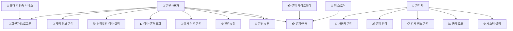

# 심장질환검사 앱 소프트웨어요구사항명세서 (SRS)

> **📱 충북대학교 심장질환검사 애플리케이션**
>
> 모바일 기반 심장 건강 검사 및 분석 시스템

---

## 📚 목차

1. **🎯 개요**
2. **👤 사용자 요구사항 정의서**
3. **📊 업무분석표**
4. **⚙️ 기능명세**
5. **🔄 Use-Case Diagram**
6. **📝 사용사례 명세**
7. **🏗️ Class Diagram**
8. **🗄️ 데이터베이스 스키마 테이블 명세**
9. **📋 클래스 명세**
10. **🧮 알고리즘 명세**
11. **🎨 사용자 인터페이스(UI) 설계**
12. **🏛️ 시스템 아키텍처 설계**

---

## 🎯 1. 개요

### 💡 프로젝트 목적
충북대학교(CBNU) 심장질환검사 앱은 사용자가 심장 관련 검사를 수행하고 결과를 분석할 수 있는 모바일/웹 애플리케이션입니다.

### 🛠️ 시스템 구성

| 구분 | 기술스택 |
|------|---------|
| **프론트엔드** | React Native + TypeScript |
| **백엔드** | Spring Boot + Java 17 |
| **데이터베이스** | MySQL |
| **ORM** | JPA |

### 🎯 주요 기능

- 👤 사용자 계정 관리 및 인증
- 🔍 심장질환 검사 실행 및 결과 분석
- 💳 결제/구독 시스템
- ⚙️ 환경설정 관리
- 🏢 백오피스 관리 시스템

## 👤 2. 사용자 요구사항 정의서

### ⚙️ 기능적 요구사항

#### 👤 사용자 관리

| ID | 요구사항 | 설명 |
|---|---------|------|
| **UR-001** | 계정 생성 및 로그인 | 사용자는 계정을 생성하고 로그인할 수 있어야 한다 |
| **UR-002** | 휴대폰 인증 | 사용자는 휴대폰 인증을 통해 본인 확인을 할 수 있어야 한다 |
| **UR-003** | 계정 복구 | 사용자는 아이디/비밀번호 찾기 기능을 이용할 수 있어야 한다 |
| **UR-004** | 자동 로그인 | 사용자는 자동 로그인 기능을 사용할 수 있어야 한다 |

#### 🔍 검사 기능

| ID | 요구사항 | 설명 |
|---|---------|------|
| **UR-005** | 데이터 입력 | 사용자는 텍스트 또는 음성을 통해 검사 데이터를 입력할 수 있어야 한다 |
| **UR-006** | 결과 분석 | 시스템은 입력된 데이터를 분석하여 6가지 유형의 결과를 제공해야 한다 |
| **UR-007** | 검사 이력 조회 | 사용자는 과거 검사 이력을 조회할 수 있어야 한다 |
| **UR-008** | 알림 기능 | 시스템은 예약 시간에 알림을 통해 검사를 유도해야 한다 |

#### 💳 결제 및 구독

| ID | 요구사항 | 설명 |
|---|---------|------|
| **UR-009** | 요금제 선택 | 사용자는 월간/연간/종신 요금제를 선택할 수 있어야 한다 |
| **UR-010** | 인앱 결제 | 시스템은 인앱 결제 기능을 제공해야 한다 |
| **UR-011** | 결제 내역 조회 | 사용자는 결제 내역을 확인할 수 있어야 한다 |

#### ⚙️ 환경설정

| ID | 요구사항 | 설명 |
|---|---------|------|
| **UR-012** | 언어 설정 | 사용자는 언어(한/영)를 선택할 수 있어야 한다 |
| **UR-013** | 입력방식 설정 | 사용자는 입력방식(텍스트/음성)을 선택할 수 있어야 한다 |
| **UR-014** | 사용시간 설정 | 사용자는 사용 시간을 설정할 수 있어야 한다 |

### 🚀 비기능적 요구사항

#### ⚡ 성능 요구사항

| ID | 요구사항 | 목표값 |
|---|---------|--------|
| **NR-001** | 검사 결과 응답시간 | 5초 이내 |
| **NR-002** | 동시 사용자 지원 | 1,000명 |
| **NR-003** | 앱 실행 시간 | 3초 이내 |

#### 🔒 보안 요구사항

| ID | 요구사항 | 설명 |
|---|---------|------|
| **NR-004** | 데이터 암호화 | 사용자 개인정보는 암호화되어 저장되어야 한다 |
| **NR-005** | 데이터 삭제/반납 | 계약 종료 시 데이터 삭제/반납 프로세스가 제공되어야 한다 |
| **NR-006** | 통신 암호화 | API 통신은 HTTPS로 암호화되어야 한다 |

#### 🔗 호환성 요구사항

| 플랫폼 | 지원 버전 |
|--------|-----------|
| **iOS** | 14.0 이상 |
| **Android** | API Level 21 이상 |
| **웹 브라우저** | Chrome, Safari, Firefox |

## 📊 3. 업무분석표

### 📋 업무영역별 분석

| 업무영역 | 주요업무 | 세부활동 | 담당자 | 우선순위 |
|---------|----------|----------|--------|----------|
| 👤 사용자관리 | 계정관리 | 회원가입, 로그인, 인증 | 백엔드개발자 | 🔴 높음 |
| 👤 사용자관리 | 프로필관리 | 정보수정, 탈퇴 | 백엔드개발자 | 🟡 중간 |
| 🔍 검사관리 | 데이터입력 | 텍스트/음성입력 처리 | 프론트엔드개발자 | 🔴 높음 |
| 🔍 검사관리 | 결과분석 | AI모델 실행, 결과생성 | 프론트엔드개발자 | 🔴 높음 |
| 🔍 검사관리 | 이력관리 | 검사기록 저장/조회 | 백엔드개발자 | 🟡 중간 |
| 💳 결제관리 | 요금정책 | 구독모델 관리 | 백엔드개발자 | 🟡 중간 |
| 💳 결제관리 | 결제처리 | 인앱결제 연동 | 프론트엔드개발자 | 🟡 중간 |
| 🏢 시스템관리 | 백오피스 | 관리자 페이지 | 백엔드개발자 | ⚪ 낮음 |
| 🏢 시스템관리 | 통계분석 | 매출통계, 사용자분석 | 백엔드개발자 | ⚪ 낮음 |

### 📈 우선순위별 업무 분류

#### 🔴 높음 (핵심 기능)
- 👤 사용자 계정관리 (회원가입, 로그인)
- 🔍 검사 데이터입력 (텍스트/음성)
- 🔍 결과분석 (AI 모델 실행)

#### 🟡 중간 (중요 기능)
- 👤 프로필 관리
- 🔍 검사 이력관리
- 💳 결제 및 구독 시스템

#### ⚪ 낮음 (부가 기능)
- 🏢 백오피스 관리자 페이지
- 📊 통계 및 분석

## ⚙️ 4. 기능명세

### 📱 프론트엔드 기능명세

| 기능 ID | 기능명 | 입력 | 처리 | 출력 |
|---------|--------|------|------|------|
| **FR-FE-001** | 🎨 앱 아이콘 고도화 | 디자인 요구사항 | 심미적·의미적 재설계 | 고품질 앱 아이콘 |
| **FR-FE-002** | 📝 입력화면 UI 고도화 | 사용자 입력 (텍스트/음성) | UI/UX 최적화 | 직관적 입력 인터페이스 |
| **FR-FE-003** | 📊 출력화면 UI 고도화 | 검사 결과 데이터 | 6가지 유형별 시각화 | 사용자 친화적 결과 화면 |
| **FR-FE-004** | 🔐 로그인/회원가입 | 사용자 계정 정보 | 유효성 검증, 서버 통신 | 로그인 성공/실패 |
| **FR-FE-005** | 🔍 아이디/비밀번호 찾기 | 사용자 식별 정보 | 본인 확인, 임시 정보 발급 | 복구된 계정 정보 |
| **FR-FE-006** | 💳 인앱 결제/구독 | 결제 요청 | 결제 게이트웨이 연동 | 결제 완료/실패 |
| **FR-FE-007** | ⚙️ 환경설정 메뉴 | 설정 변경 요청 | 설정값 검증 및 저장 | 업데이트된 설정 |
| **FR-FE-008** | 🎤 음성 입력 기능 | 음성 데이터 | Speech-to-Text 변환 | 텍스트 데이터 |
| **FR-FE-009** | 🔔 예약 알림 기능 | 예약 시간 설정 | 푸시 알림 스케줄링 | 검사 알림 |
| **FR-FE-010** | 🤖 모델 실행 | 검사 데이터 | 로컬 AI 모델 실행 | 분석 결과 |
| **FR-FE-011** | 📡 서버 전송 | 검사 결과 | API 호출 | 저장 확인 |

### 🖥️ 백엔드 기능명세

| 기능 ID | 기능명 | 입력 | 처리 | 출력 |
|---------|--------|------|------|------|
| **FR-BE-001** | 👤 사용자 계정 정보 API | 계정 생성/조회 요청 | DB 저장/검색 | 응답 데이터 |
| **FR-BE-002** | 🔐 로그인·인증 처리 | 로그인 정보 | 인증 검증, 토큰 생성 | 인증 토큰 |
| **FR-BE-003** | 💾 검사 결과 저장 | 검사 데이터 | 데이터 검증, DB 저장 | 저장 상태 |
| **FR-BE-004** | 📝 검사 이력 조회 API | 사용자 ID, 조회 조건 | DB 검색, 데이터 정렬 | 이력 목록 |
| **FR-BE-005** | 💳 결제 내역 관리 | 결제 정보 | 결제 검증, 이력 저장 | 결제 상태 |
| **FR-BE-006** | 💰 요금 정책 관리 | 정책 설정 | 비용 계산, 적용 | 요금 정보 |
| **FR-BE-007** | ⚙️ 환경설정 관리 | 설정 데이터 | 유효성 검증, 저장 | 설정 정보 |
| **FR-BE-008** | 🏢 백오피스 관리 | 관리자 요청 | 권한 검증, 데이터 제공 | 관리 화면 |
| **FR-BE-009** | 📊 매출 통계 조회 | 통계 조회 조건 | 데이터 집계, 분석 | 통계 보고서 |
| **FR-BE-010** | 🚀 앱 배포 관리 | 배포 요청 | 스토어 연동, 버전 관리 | 배포 상태 |
| **FR-BE-011** | 🔔 배포 알림 | 배포 이벤트 | 알림 발송 | 알림 전송 상태 |
| **FR-BE-012** | 🔒 데이터 암호화 | 사용자 정보 | 암호화 알고리즘 적용 | 암호화된 데이터 |
| **FR-BE-013** | 🗑️ 데이터 삭제/반납 | 삭제 요청 | 데이터 완전 삭제 | 삭제 완료 확인 |

## 🔄 5. Use-Case Diagram

### 🎭 액터 및 사용사례

#### 👤 일반사용자 (Primary Actor)
- 🔐 회원가입/로그인
- 👤 계정 정보 관리
- 🩺 심장질환 검사 실행
- 📊 검사 결과 조회
- 📝 검사 이력 관리
- ⚙️ 환경설정
- 💳 결제/구독
- 🔔 알림 설정

#### 🏢 관리자 (Secondary Actor)
- 👥 사용자 관리
- 💰 결제 관리
- 📋 검사 정보 관리
- 📈 통계 조회
- ⚙️ 시스템 설정

#### 🌐 외부 시스템 (External Actor)
- 📱 휴대폰 인증 서비스
- 💳 결제 게이트웨이
- 🏪 앱 스토어

### 📊 Use-Case 상호작용 다이어그램



## 📝 6. 사용사례 명세

### 🔐 UC-001: 회원가입

| 항목 | 내용 |
|------|------|
| **주요 액터** | 👤 일반사용자 |
| **전제조건** | 📱 앱이 설치되어 있음 |
| **후조건** | ✅ 사용자 계정이 생성됨 |

#### 📋 주 시나리오
1. 👤 사용자가 회원가입 버튼을 클릭한다
2. 🖥️ 시스템이 회원가입 폼을 표시한다
3. ✏️ 사용자가 계정 정보를 입력한다
4. 📱 시스템이 휴대폰 인증을 요청한다
5. 🔢 사용자가 인증번호를 입력한다
6. ✅ 시스템이 계정을 생성하고 확인 메시지를 표시한다

#### 🔀 대안 시나리오
> **4a.** 인증번호가 틀린 경우: 📤 재전송 또는 🔄 재입력 유도

---

### 🩺 UC-002: 심장질환 검사 실행

| 항목 | 내용 |
|------|------|
| **주요 액터** | 👤 일반사용자 |
| **전제조건** | 🔑 사용자가 로그인되어 있음 |
| **후조건** | 💾 검사 결과가 저장되고 표시됨 |

#### 📋 주 시나리오
1. 🔘 사용자가 검사 시작 버튼을 클릭한다
2. ⚙️ 시스템이 입력 방식 선택을 요청한다
3. 🎯 사용자가 텍스트 또는 음성 입력을 선택한다
4. 📝 사용자가 검사 데이터를 입력한다
5. 🤖 시스템이 데이터를 분석한다
6. 📊 시스템이 6가지 유형 중 하나의 결과를 표시한다
7. 💾 시스템이 결과를 서버에 저장한다

#### 🔀 대안 시나리오
> **4a.** 음성 입력 실패: 🔄 재입력 또는 📝 텍스트 입력 전환
>
> **5a.** 분석 실패: ❌ 오류 메시지 표시 및 🔄 재시도

---

### 💳 UC-003: 결제/구독

| 항목 | 내용 |
|------|------|
| **주요 액터** | 👤 일반사용자 |
| **전제조건** | 🔑 사용자가 로그인되어 있고 💰 결제할 요금제를 선택함 |
| **후조건** | ✅ 구독이 활성화되고 💾 결제 내역이 저장됨 |

#### 📋 주 시나리오
1. 🎯 사용자가 요금제를 선택한다
2. 💳 시스템이 결제 정보 입력 화면을 표시한다
3. ✏️ 사용자가 결제 정보를 입력한다
4. 🔄 시스템이 결제 게이트웨이로 결제를 처리한다
5. ✅ 결제가 승인되면 구독이 활성화된다
6. 📧 시스템이 결제 완료 확인을 표시한다

#### 🔀 대안 시나리오
> **4a.** 결제 실패: ❌ 실패 사유 표시 및 🔄 재시도 옵션 제공

---

### 🏢 UC-004: 백오피스 관리

| 항목 | 내용 |
|------|------|
| **주요 액터** | 🏢 관리자 |
| **전제조건** | 🔑 관리자가 로그인되어 있음 |
| **후조건** | 💾 관리 데이터가 업데이트됨 |

#### 📋 주 시나리오
1. 🖥️ 관리자가 백오피스에 접근한다
2. 📋 시스템이 관리 메뉴를 표시한다
3. 🎯 관리자가 관리할 항목을 선택한다
4. 📊 시스템이 해당 데이터를 표시한다
5. ✏️ 관리자가 필요한 수정을 수행한다
6. 💾 시스템이 변경사항을 저장한다

## 🏗️ 7. Class Diagram

### 📋 핵심 엔티티 클래스

#### 👤 User (사용자)
```java
class User {
    - userId: Long
    - username: String
    - password: String
    - email: String
    - phoneNumber: String
    - createdAt: Date
    --
    + register()
    + login()
    + updateProfile()
    + deleteAccount()
}
```

#### 🩺 TestResult (검사 결과)
```java
class TestResult {
    - resultId: Long
    - userId: Long
    - testData: String
    - resultType: Int
    - testDate: Date
    - analysisResult: JSON
    --
    + save()
    + getByUserId()
    + getHistory()
    + analyze()
}
```

#### 💳 Subscription (구독)
```java
class Subscription {
    - subscriptionId: Long
    - userId: Long
    - planType: String
    - startDate: Date
    - endDate: Date
    - status: String
    --
    + activate()
    + deactivate()
    + isActive()
    + renew()
}
```

### 🔗 관계형 클래스

#### ⚙️ UserSettings (사용자 설정)
```java
class UserSettings {
    - settingsId: Long
    - userId: Long
    - language: String
    - inputMethod: String
    - usageTime: Int
    - notifications: Boolean
    --
    + updateLanguage()
    + setInputMethod()
    + setUsageTime()
    + toggleNotification()
}
```

#### 💰 Payment (결제)
```java
class Payment {
    - paymentId: Long
    - userId: Long
    - amount: BigDecimal
    - paymentDate: Date
    - paymentMethod: String
    - status: String
    --
    + processPayment()
    + refund()
    + getHistory()
    + validatePayment()
}
```

### 🏢 관리자 클래스

#### 👨‍💼 Admin (관리자)
```java
class Admin {
    - adminId: Long
    - username: String
    - password: String
    - role: String
    - lastLogin: Date
    --
    + login()
    + manageUsers()
    + viewStatistics()
    + generateReports()
}
```

#### ⚙️ SystemConfig (시스템 설정)
```java
class SystemConfig {
    - configId: Long
    - configKey: String
    - configValue: String
    - description: String
    - updatedAt: Date
    --
    + getValue()
    + setValue()
    + getAll()
    + reload()
}
```

#### 🔔 NotificationJob (알림 작업)
```java
class NotificationJob {
    - jobId: Long
    - userId: Long
    - scheduleTime: DateTime
    - message: String
    - status: String
    --
    + schedule()
    + send()
    + cancel()
    + getStatus()
}
```

### 🔗 클래스 관계도

```mermaid
classDiagram
    User ||--o{ TestResult : has
    User ||--|| UserSettings : has
    User ||--o{ Subscription : has
    User ||--o{ Payment : makes
    User ||--o{ NotificationJob : receives

    Admin ||--o{ SystemConfig : manages

    class User {
        +Long userId
        +String username
        +register()
        +login()
    }

    class TestResult {
        +Long resultId
        +String testData
        +analyze()
    }

    class Subscription {
        +String planType
        +activate()
    }
```

## 🗄️ 8. 데이터베이스 스키마 테이블 명세

> **💾 MySQL 8.0 기반 데이터베이스 설계**

### 8.1 users 테이블
```sql
CREATE TABLE users (
    user_id BIGINT AUTO_INCREMENT PRIMARY KEY,
    username VARCHAR(50) NOT NULL UNIQUE,
    password VARCHAR(255) NOT NULL,
    email VARCHAR(100) NOT NULL UNIQUE,
    phone_number VARCHAR(20),
    created_at TIMESTAMP DEFAULT CURRENT_TIMESTAMP,
    updated_at TIMESTAMP DEFAULT CURRENT_TIMESTAMP ON UPDATE CURRENT_TIMESTAMP,
    status ENUM('ACTIVE', 'INACTIVE', 'SUSPENDED') DEFAULT 'ACTIVE',
    INDEX idx_username (username),
    INDEX idx_email (email)
);
```

### 8.2 test_results 테이블
```sql
CREATE TABLE test_results (
    result_id BIGINT AUTO_INCREMENT PRIMARY KEY,
    user_id BIGINT NOT NULL,
    test_data TEXT NOT NULL,
    result_type TINYINT NOT NULL COMMENT '1-6: 6가지 결과 유형',
    analysis_result JSON,
    test_date TIMESTAMP DEFAULT CURRENT_TIMESTAMP,
    input_method ENUM('TEXT', 'VOICE') DEFAULT 'TEXT',
    FOREIGN KEY (user_id) REFERENCES users(user_id) ON DELETE CASCADE,
    INDEX idx_user_date (user_id, test_date),
    INDEX idx_result_type (result_type)
);
```

### 8.3 subscriptions 테이블
```sql
CREATE TABLE subscriptions (
    subscription_id BIGINT AUTO_INCREMENT PRIMARY KEY,
    user_id BIGINT NOT NULL,
    plan_type ENUM('MONTHLY', 'YEARLY', 'LIFETIME') NOT NULL,
    start_date TIMESTAMP DEFAULT CURRENT_TIMESTAMP,
    end_date TIMESTAMP,
    status ENUM('ACTIVE', 'EXPIRED', 'CANCELLED') DEFAULT 'ACTIVE',
    auto_renew BOOLEAN DEFAULT TRUE,
    FOREIGN KEY (user_id) REFERENCES users(user_id) ON DELETE CASCADE,
    INDEX idx_user_status (user_id, status),
    INDEX idx_end_date (end_date)
);
```

### 8.4 payments 테이블
```sql
CREATE TABLE payments (
    payment_id BIGINT AUTO_INCREMENT PRIMARY KEY,
    user_id BIGINT NOT NULL,
    subscription_id BIGINT,
    amount DECIMAL(10,2) NOT NULL,
    currency VARCHAR(3) DEFAULT 'KRW',
    payment_date TIMESTAMP DEFAULT CURRENT_TIMESTAMP,
    payment_method ENUM('CREDIT_CARD', 'GOOGLE_PAY', 'APPLE_PAY') NOT NULL,
    transaction_id VARCHAR(100),
    status ENUM('PENDING', 'COMPLETED', 'FAILED', 'REFUNDED') DEFAULT 'PENDING',
    FOREIGN KEY (user_id) REFERENCES users(user_id) ON DELETE CASCADE,
    FOREIGN KEY (subscription_id) REFERENCES subscriptions(subscription_id),
    INDEX idx_user_date (user_id, payment_date),
    INDEX idx_transaction (transaction_id)
);
```

### 8.5 user_settings 테이블
```sql
CREATE TABLE user_settings (
    settings_id BIGINT AUTO_INCREMENT PRIMARY KEY,
    user_id BIGINT NOT NULL,
    language ENUM('KO', 'EN') DEFAULT 'KO',
    input_method ENUM('TEXT', 'VOICE', 'BOTH') DEFAULT 'TEXT',
    usage_time_per_day TINYINT DEFAULT 5,
    notification_enabled BOOLEAN DEFAULT TRUE,
    notification_time TIME DEFAULT '09:00:00',
    updated_at TIMESTAMP DEFAULT CURRENT_TIMESTAMP ON UPDATE CURRENT_TIMESTAMP,
    FOREIGN KEY (user_id) REFERENCES users(user_id) ON DELETE CASCADE,
    UNIQUE KEY unique_user (user_id)
);
```

### 8.6 admins 테이블
```sql
CREATE TABLE admins (
    admin_id BIGINT AUTO_INCREMENT PRIMARY KEY,
    username VARCHAR(50) NOT NULL UNIQUE,
    password VARCHAR(255) NOT NULL,
    role ENUM('SUPER_ADMIN', 'ADMIN', 'OPERATOR') DEFAULT 'OPERATOR',
    last_login TIMESTAMP,
    created_at TIMESTAMP DEFAULT CURRENT_TIMESTAMP,
    status ENUM('ACTIVE', 'INACTIVE') DEFAULT 'ACTIVE',
    INDEX idx_username (username)
);
```

### 8.7 system_config 테이블
```sql
CREATE TABLE system_config (
    config_id BIGINT AUTO_INCREMENT PRIMARY KEY,
    config_key VARCHAR(100) NOT NULL UNIQUE,
    config_value TEXT,
    description VARCHAR(255),
    updated_at TIMESTAMP DEFAULT CURRENT_TIMESTAMP ON UPDATE CURRENT_TIMESTAMP,
    updated_by BIGINT,
    FOREIGN KEY (updated_by) REFERENCES admins(admin_id)
);
```

### 8.8 notification_jobs 테이블
```sql
CREATE TABLE notification_jobs (
    job_id BIGINT AUTO_INCREMENT PRIMARY KEY,
    user_id BIGINT NOT NULL,
    schedule_time TIMESTAMP NOT NULL,
    message TEXT NOT NULL,
    status ENUM('SCHEDULED', 'SENT', 'FAILED', 'CANCELLED') DEFAULT 'SCHEDULED',
    created_at TIMESTAMP DEFAULT CURRENT_TIMESTAMP,
    sent_at TIMESTAMP NULL,
    FOREIGN KEY (user_id) REFERENCES users(user_id) ON DELETE CASCADE,
    INDEX idx_schedule_time (schedule_time),
    INDEX idx_user_status (user_id, status)
);
```

---

## 9. 클래스 명세

### 9.1 User 클래스
```java
@Entity
@Table(name = "users")
public class User {
    @Id
    @GeneratedValue(strategy = GenerationType.IDENTITY)
    private Long userId;

    @Column(unique = true, nullable = false)
    private String username;

    @Column(nullable = false)
    private String password;

    @Column(unique = true, nullable = false)
    private String email;

    private String phoneNumber;

    @Enumerated(EnumType.STRING)
    private UserStatus status;

    @CreationTimestamp
    private LocalDateTime createdAt;

    @UpdateTimestamp
    private LocalDateTime updatedAt;

    @OneToMany(mappedBy = "user", cascade = CascadeType.ALL)
    private List<TestResult> testResults;

    @OneToMany(mappedBy = "user", cascade = CascadeType.ALL)
    private List<Subscription> subscriptions;

    // 생성자, getter, setter 메서드
    public User() {}

    public User(String username, String password, String email) {
        this.username = username;
        this.password = password;
        this.email = email;
        this.status = UserStatus.ACTIVE;
    }

    // 비즈니스 메서드
    public boolean isActive() {
        return status == UserStatus.ACTIVE;
    }

    public void deactivate() {
        this.status = UserStatus.INACTIVE;
    }

    public boolean hasActiveSubscription() {
        return subscriptions.stream()
            .anyMatch(sub -> sub.isActive());
    }
}
```

### 9.2 TestResult 클래스
```java
@Entity
@Table(name = "test_results")
public class TestResult {
    @Id
    @GeneratedValue(strategy = GenerationType.IDENTITY)
    private Long resultId;

    @ManyToOne(fetch = FetchType.LAZY)
    @JoinColumn(name = "user_id")
    private User user;

    @Column(columnDefinition = "TEXT")
    private String testData;

    private Integer resultType; // 1-6

    @Column(columnDefinition = "JSON")
    private String analysisResult;

    @Enumerated(EnumType.STRING)
    private InputMethod inputMethod;

    @CreationTimestamp
    private LocalDateTime testDate;

    // 생성자
    public TestResult() {}

    public TestResult(User user, String testData, InputMethod inputMethod) {
        this.user = user;
        this.testData = testData;
        this.inputMethod = inputMethod;
    }

    // 비즈니스 메서드
    public void setAnalysisResult(HeartDiseaseAnalysis analysis) {
        this.resultType = analysis.getResultType();
        this.analysisResult = analysis.toJson();
    }

    public HeartDiseaseAnalysis getAnalysis() {
        return HeartDiseaseAnalysis.fromJson(this.analysisResult);
    }
}
```

### 9.3 Subscription 클래스
```java
@Entity
@Table(name = "subscriptions")
public class Subscription {
    @Id
    @GeneratedValue(strategy = GenerationType.IDENTITY)
    private Long subscriptionId;

    @ManyToOne(fetch = FetchType.LAZY)
    @JoinColumn(name = "user_id")
    private User user;

    @Enumerated(EnumType.STRING)
    private PlanType planType;

    @CreationTimestamp
    private LocalDateTime startDate;

    private LocalDateTime endDate;

    @Enumerated(EnumType.STRING)
    private SubscriptionStatus status;

    private Boolean autoRenew;

    // 생성자
    public Subscription() {}

    public Subscription(User user, PlanType planType) {
        this.user = user;
        this.planType = planType;
        this.status = SubscriptionStatus.ACTIVE;
        this.autoRenew = true;

        if (planType != PlanType.LIFETIME) {
            this.endDate = calculateEndDate(planType);
        }
    }

    // 비즈니스 메서드
    public boolean isActive() {
        if (status != SubscriptionStatus.ACTIVE) {
            return false;
        }

        if (planType == PlanType.LIFETIME) {
            return true;
        }

        return endDate != null && endDate.isAfter(LocalDateTime.now());
    }

    public void expire() {
        this.status = SubscriptionStatus.EXPIRED;
    }

    public void renew() {
        if (planType != PlanType.LIFETIME) {
            this.endDate = calculateEndDate(planType);
            this.status = SubscriptionStatus.ACTIVE;
        }
    }

    private LocalDateTime calculateEndDate(PlanType planType) {
        LocalDateTime now = LocalDateTime.now();
        switch (planType) {
            case MONTHLY:
                return now.plusMonths(1);
            case YEARLY:
                return now.plusYears(1);
            default:
                return null;
        }
    }
}
```

---

## 10. 알고리즘 명세

### 10.1 심장질환 분석 알고리즘
```java
public class HeartDiseaseAnalysisAlgorithm {

    /**
     * 심장질환 분석 메인 알고리즘
     * @param inputData 사용자 입력 데이터
     * @return 분석 결과 (1-6 타입)
     */
    public HeartDiseaseAnalysis analyze(String inputData) {
        // 1단계: 데이터 전처리
        ProcessedData processedData = preprocessData(inputData);

        // 2단계: 특징 추출
        FeatureVector features = extractFeatures(processedData);

        // 3단계: ML 모델 실행
        MLModelResult modelResult = executeMLModel(features);

        // 4단계: 결과 분류 (1-6 타입)
        int resultType = classifyResult(modelResult);

        // 5단계: 결과 메시지 생성
        String message = generateResultMessage(resultType, modelResult);

        return new HeartDiseaseAnalysis(resultType, message, modelResult.getConfidence());
    }

    /**
     * 데이터 전처리
     */
    private ProcessedData preprocessData(String inputData) {
        // 텍스트 정규화
        String normalized = inputData.toLowerCase().trim();

        // 불용어 제거
        List<String> tokens = removeStopWords(tokenize(normalized));

        // 의료 용어 표준화
        List<String> standardized = standardizeMedicalTerms(tokens);

        return new ProcessedData(standardized);
    }

    /**
     * 특징 추출
     */
    private FeatureVector extractFeatures(ProcessedData data) {
        Map<String, Double> features = new HashMap<>();

        // 증상 관련 특징
        features.put("symptom_severity", calculateSymptomSeverity(data));
        features.put("symptom_frequency", calculateSymptomFrequency(data));

        // 키워드 기반 특징
        features.put("chest_pain_indicator", detectChestPain(data));
        features.put("breathing_difficulty", detectBreathingDifficulty(data));
        features.put("fatigue_level", detectFatigueLevel(data));

        return new FeatureVector(features);
    }

    /**
     * ML 모델 실행 (실제로는 프론트엔드에서 실행)
     */
    private MLModelResult executeMLModel(FeatureVector features) {
        // 이 부분은 실제로는 프론트엔드의 TensorFlow.js나
        // Core ML에서 실행됨

        // 여기서는 서버에서 검증용으로만 사용
        double[] inputs = features.toArray();
        double[] outputs = trainedModel.predict(inputs);

        return new MLModelResult(outputs);
    }

    /**
     * 결과 분류 (1-6 타입)
     */
    private int classifyResult(MLModelResult result) {
        double[] probabilities = result.getProbabilities();

        // 가장 높은 확률의 인덱스를 찾음
        int maxIndex = 0;
        for (int i = 1; i < probabilities.length; i++) {
            if (probabilities[i] > probabilities[maxIndex]) {
                maxIndex = i;
            }
        }

        return maxIndex + 1; // 1-6 범위로 변환
    }

    /**
     * 결과 메시지 생성
     */
    private String generateResultMessage(int resultType, MLModelResult result) {
        double confidence = result.getConfidence();

        switch (resultType) {
            case 1:
                return String.format("정상 범위입니다. (신뢰도: %.1f%%)", confidence * 100);
            case 2:
                return String.format("경미한 주의사항이 있습니다. (신뢰도: %.1f%%)", confidence * 100);
            case 3:
                return String.format("추가 검진을 권장합니다. (신뢰도: %.1f%%)", confidence * 100);
            case 4:
                return String.format("의료진 상담이 필요합니다. (신뢰도: %.1f%%)", confidence * 100);
            case 5:
                return String.format("즉시 병원 방문을 권장합니다. (신뢰도: %.1f%%)", confidence * 100);
            case 6:
                return String.format("응급상황입니다. 즉시 응급실로 가세요. (신뢰도: %.1f%%)", confidence * 100);
            default:
                return "분석 오류가 발생했습니다.";
        }
    }
}
```

### 10.2 음성-텍스트 변환 알고리즘
```typescript
class SpeechToTextProcessor {

    /**
     * 음성 데이터를 텍스트로 변환
     */
    async convertSpeechToText(audioData: Blob): Promise<string> {
        try {
            // 1단계: 오디오 전처리
            const processedAudio = await this.preprocessAudio(audioData);

            // 2단계: 플랫폼별 STT API 호출
            const platform = Platform.OS;
            let transcription: string;

            if (platform === 'ios') {
                transcription = await this.processiOSSpeech(processedAudio);
            } else {
                transcription = await this.processAndroidSpeech(processedAudio);
            }

            // 3단계: 후처리
            const cleanedText = this.postprocessText(transcription);

            return cleanedText;

        } catch (error) {
            throw new Error(`음성 변환 실패: ${error.message}`);
        }
    }

    /**
     * 오디오 전처리
     */
    private async preprocessAudio(audioData: Blob): Promise<ArrayBuffer> {
        // 노이즈 제거
        const denoised = await this.removeNoise(audioData);

        // 볼륨 정규화
        const normalized = await this.normalizeVolume(denoised);

        // 샘플링 레이트 조정
        const resampled = await this.resample(normalized, 16000);

        return resampled;
    }

    /**
     * iOS Speech Framework 사용
     */
    private async processiOSSpeech(audioData: ArrayBuffer): Promise<string> {
        const recognition = new SFSpeechRecognizer('ko-KR');
        const request = new SFSpeechAudioBufferRecognitionRequest();

        request.audioBuffer = audioData;
        request.shouldReportPartialResults = false;

        return new Promise((resolve, reject) => {
            recognition.recognitionTask(request, (result, error) => {
                if (error) {
                    reject(error);
                } else {
                    resolve(result.bestTranscription.formattedString);
                }
            });
        });
    }

    /**
     * Android Speech API 사용
     */
    private async processAndroidSpeech(audioData: ArrayBuffer): Promise<string> {
        const recognizer = new SpeechRecognizer();
        const intent = new RecognizerIntent();

        intent.action = RecognizerIntent.ACTION_RECOGNIZE_SPEECH;
        intent.language = 'ko-KR';
        intent.audioData = audioData;

        return new Promise((resolve, reject) => {
            recognizer.startListening(intent, {
                onResults: (results) => resolve(results[0]),
                onError: (error) => reject(error)
            });
        });
    }

    /**
     * 텍스트 후처리
     */
    private postprocessText(text: string): string {
        // 의료 용어 보정
        let corrected = this.correctMedicalTerms(text);

        // 문장 부호 정리
        corrected = this.normalizePunctuation(corrected);

        // 불필요한 공백 제거
        corrected = corrected.trim().replace(/\s+/g, ' ');

        return corrected;
    }
}
```

### 10.3 알림 스케줄링 알고리즘
```java
@Service
public class NotificationScheduler {

    /**
     * 사용자 알림 스케줄링
     */
    public void scheduleUserNotifications(User user, UserSettings settings) {
        // 기존 알림 취소
        cancelExistingNotifications(user.getUserId());

        // 새로운 알림 스케줄 생성
        List<LocalDateTime> scheduleTimes = calculateScheduleTimes(settings);

        for (LocalDateTime scheduleTime : scheduleTimes) {
            scheduleNotification(user, scheduleTime, settings);
        }
    }

    /**
     * 알림 시간 계산
     */
    private List<LocalDateTime> calculateScheduleTimes(UserSettings settings) {
        List<LocalDateTime> times = new ArrayList<>();

        LocalTime baseTime = settings.getNotificationTime();
        int dailyUsage = settings.getUsageTimePerDay();

        // 일주일간의 알림 시간 계산
        for (int day = 0; day < 7; day++) {
            LocalDate date = LocalDate.now().plusDays(day);

            // 하루에 설정된 횟수만큼 분산
            for (int i = 0; i < dailyUsage; i++) {
                // 기본 시간에서 간격을 두어 분산
                LocalTime time = baseTime.plusHours(i * (16 / dailyUsage));
                times.add(LocalDateTime.of(date, time));
            }
        }

        return times;
    }

    /**
     * 개별 알림 스케줄링
     */
    private void scheduleNotification(User user, LocalDateTime scheduleTime, UserSettings settings) {
        String message = generateNotificationMessage(settings.getLanguage());

        NotificationJob job = NotificationJob.builder()
            .userId(user.getUserId())
            .scheduleTime(scheduleTime)
            .message(message)
            .status(NotificationStatus.SCHEDULED)
            .build();

        notificationJobRepository.save(job);

        // 시스템 스케줄러에 등록
        taskScheduler.schedule(
            () -> sendNotification(job),
            Instant.from(scheduleTime.atZone(ZoneId.systemDefault()))
        );
    }

    /**
     * 알림 메시지 생성
     */
    private String generateNotificationMessage(String language) {
        if ("EN".equals(language)) {
            return "Time for your heart health check! Start your test now.";
        } else {
            return "심장 건강 검사 시간입니다! 지금 검사를 시작하세요.";
        }
    }

    /**
     * 알림 발송
     */
    private void sendNotification(NotificationJob job) {
        try {
            // FCM을 통한 푸시 알림 발송
            FirebaseMessage message = FirebaseMessage.builder()
                .setToken(getUserFCMToken(job.getUserId()))
                .setNotification(Notification.builder()
                    .setTitle("심장질환 검사")
                    .setBody(job.getMessage())
                    .build())
                .build();

            String response = FirebaseMessaging.getInstance().send(message);

            // 발송 완료 처리
            job.setStatus(NotificationStatus.SENT);
            job.setSentAt(LocalDateTime.now());
            notificationJobRepository.save(job);

        } catch (Exception e) {
            // 발송 실패 처리
            job.setStatus(NotificationStatus.FAILED);
            notificationJobRepository.save(job);

            log.error("알림 발송 실패 - Job ID: {}, Error: {}",
                      job.getJobId(), e.getMessage());
        }
    }
}
```

---

## 11. 사용자 인터페이스(UI) 설계

### 11.1 메인 화면 설계
```
┌─────────────────────────────────────┐
│  ❤️ Heart Health Checker           ☰ │
├─────────────────────────────────────┤
│                                     │
│    🔴 [   검사 시작하기   ]           │
│                                     │
│  📊 최근 검사 결과                    │
│  ┌─────────────────────────────────┐ │
│  │ 2024.01.15  정상          📈    │ │
│  │ 2024.01.10  주의 필요     ⚠️     │ │
│  │ 2024.01.05  정상          📈    │ │
│  └─────────────────────────────────┘ │
│                                     │
│  🎯 오늘의 목표: 3/5 완료             │
│                                     │
│  📅 [   검사 이력 보기   ]            │
│  ⚙️  [   설정           ]            │
│                                     │
└─────────────────────────────────────┘
```

### 11.2 검사 입력 화면 설계
```
┌─────────────────────────────────────┐
│  ← 심장질환 검사                      │
├─────────────────────────────────────┤
│                                     │
│  입력 방식을 선택하세요                │
│                                     │
│  ┌─────────────────┐ ┌─────────────┐ │
│  │  📝 텍스트 입력  │ │  🎤 음성입력 │ │
│  │                │ │             │ │
│  │   키보드로      │ │  마이크로    │ │
│  │   직접 입력     │ │  말하기      │ │
│  └─────────────────┘ └─────────────┘ │
│                                     │
│  💡 증상을 자세히 설명해주세요          │
│     예: "가슴이 답답하고 숨이 차요"     │
│                                     │
│  ┌─────────────────────────────────┐ │
│  │ 여기에 증상을 입력하세요...        │ │
│  │                               │ │
│  │                               │ │
│  │                               │ │
│  └─────────────────────────────────┘ │
│                                     │
│         [ 분석 시작하기 ]             │
│                                     │
└─────────────────────────────────────┘
```

### 11.3 결과 화면 설계 (6가지 타입)

#### 타입 1: 정상
```
┌─────────────────────────────────────┐
│  검사 결과                          │
├─────────────────────────────────────┤
│                                     │
│         🟢                          │
│        정상                         │
│                                     │
│  현재 상태가 양호합니다.              │
│  건강한 생활습관을 유지하세요.         │
│                                     │
│  📊 신뢰도: 95%                      │
│  📅 검사일시: 2024.01.15 14:30       │
│                                     │
│  📋 권장사항:                        │
│  • 규칙적인 운동                    │
│  • 균형잡힌 식단                    │
│  • 충분한 휴식                      │
│                                     │
│  [ 결과 저장 ]  [ 다시 검사 ]         │
│                                     │
└─────────────────────────────────────┘
```

#### 타입 6: 응급상황
```
┌─────────────────────────────────────┐
│  🚨 응급상황 🚨                      │
├─────────────────────────────────────┤
│                                     │
│         🔴                          │
│      응급상황                       │
│                                     │
│  즉시 응급실로 가세요!                │
│                                     │
│  📞 [ 119 신고 ]                     │
│  🏥 [ 가까운 병원 찾기 ]               │
│                                     │
│  📊 신뢰도: 98%                      │
│  📅 검사일시: 2024.01.15 14:30       │
│                                     │
│  ⚠️ 주요 증상:                       │
│  • 심한 가슴 통증                   │
│  • 호흡곤란                         │
│  • 의식 저하                       │
│                                     │
│  [ 응급연락처 ]  [ 위치 공유 ]        │
│                                     │
└─────────────────────────────────────┘
```

### 11.4 설정 화면 설계
```
┌─────────────────────────────────────┐
│  ← 설정                             │
├─────────────────────────────────────┤
│                                     │
│  👤 계정 설정                        │
│  ├ 프로필 수정                      │
│  ├ 비밀번호 변경                    │
│  └ 계정 삭제                        │
│                                     │
│  🌐 언어 설정                        │
│  ├ 한국어        ✓                  │
│  └ English                          │
│                                     │
│  🎤 입력 방식                        │
│  ├ 텍스트 입력   ○                  │
│  ├ 음성 입력     ●                  │
│  └ 둘 다 사용    ○                  │
│                                     │
│  ⏰ 알림 설정                        │
│  ├ 알림 허용     🔘                 │
│  ├ 알림 시간     09:00              │
│  └ 하루 횟수     5회                │
│                                     │
│  💳 구독 관리                        │
│  ├ 현재 요금제   월간 구독           │
│  ├ 결제 내역                        │
│  └ 요금제 변경                      │
│                                     │
└─────────────────────────────────────┘
```

### 11.5 반응형 웹 디자인 (백오피스)
```
데스크톱 (1200px+)
┌─────────────────────────────────────────────────────────────────────┐
│ 🏥 Heart Disease Admin                                      👤 Admin │
├─────────────────────────────────────────────────────────────────────┤
│ 📊 Dashboard │ 👥 Users │ 💳 Payments │ 📈 Analytics │ ⚙️ Settings   │
├─────────────────────────────────────────────────────────────────────┤
│                                                                     │
│  📊 오늘의 통계                 📈 월간 매출                         │
│  ┌─────────────────────┐       ┌─────────────────────────────────┐   │
│  │ 총 사용자: 1,234     │       │        ₩15,000,000              │   │
│  │ 활성 구독: 856       │       │                                 │   │
│  │ 오늘 검사: 423       │       │    📊 [월간 차트]               │   │
│  │ 새 가입자: 12        │       │                                 │   │
│  └─────────────────────┘       └─────────────────────────────────┘   │
│                                                                     │
│  📋 최근 활동                                                       │
│  ┌─────────────────────────────────────────────────────────────┐   │
│  │ 2024.01.15 14:30  사용자123  검사 완료  결과: 정상          │   │
│  │ 2024.01.15 14:25  사용자456  결제 완료  월간구독            │   │
│  │ 2024.01.15 14:20  사용자789  회원가입   이메일 인증 완료     │   │
│  └─────────────────────────────────────────────────────────────┘   │
│                                                                     │
└─────────────────────────────────────────────────────────────────────┘
```

### 11.6 UI 컴포넌트 라이브러리
```typescript
// Button 컴포넌트
interface ButtonProps {
  variant: 'primary' | 'secondary' | 'danger' | 'success';
  size: 'small' | 'medium' | 'large';
  disabled?: boolean;
  loading?: boolean;
  onPress: () => void;
  children: React.ReactNode;
}

// Card 컴포넌트
interface CardProps {
  title?: string;
  subtitle?: string;
  icon?: string;
  variant: 'normal' | 'success' | 'warning' | 'danger';
  children: React.ReactNode;
}

// Input 컴포넌트
interface InputProps {
  type: 'text' | 'email' | 'password' | 'phone';
  placeholder: string;
  value: string;
  onChangeText: (text: string) => void;
  validation?: ValidationRule[];
  error?: string;
}

// Modal 컴포넌트
interface ModalProps {
  visible: boolean;
  title: string;
  type: 'info' | 'warning' | 'error' | 'success';
  onClose: () => void;
  children: React.ReactNode;
}
```

---

## 12. 시스템 아키텍처 설계

### 12.1 전체 시스템 아키텍처
```
                    인터넷
                      │
              ┌───────────────┐
              │  Load Balancer │
              │    (AWS ELB)   │
              └───────────────┘
                      │
    ┌─────────────────┼─────────────────┐
    │                 │                 │
┌───────────┐ ┌───────────┐ ┌───────────┐
│Spring Boot│ │Spring Boot│ │Spring Boot│
│Instance 1 │ │Instance 2 │ │Instance 3 │
└───────────┘ └───────────┘ └───────────┘
    │                 │                 │
    └─────────────────┼─────────────────┘
                      │
              ┌───────────────┐
              │   MySQL       │
              │   Master      │
              └───────────────┘
                      │
                ┌─────────────┐
                │   MySQL     │
                │   Slave     │
                └─────────────┘

모바일 앱 (React Native)
┌─────────────────────────────────┐
│         프론트엔드               │
├─────────────────────────────────┤
│ • React Native + TypeScript     │
│ • TensorFlow.js (AI 모델)       │
│ • React Navigation              │
│ • AsyncStorage                  │
│ • Push Notifications            │
└─────────────────────────────────┘
           │ HTTPS/REST API
           ▼
┌─────────────────────────────────┐
│          백엔드                 │
├─────────────────────────────────┤
│ • Spring Boot + Java 17         │
│ • Spring Security (JWT)         │
│ • Spring Data JPA               │
│ • Redis (캐시/세션)             │
│ • AWS S3 (파일 저장)            │
└─────────────────────────────────┘
           │ JDBC
           ▼
┌─────────────────────────────────┐
│         데이터베이스            │
├─────────────────────────────────┤
│ • MySQL 8.0                     │
│ • Master-Slave 복제            │
│ • 백업 및 복구 시스템           │
└─────────────────────────────────┘
```

### 12.2 마이크로서비스 아키텍처 (확장 시)
```
API Gateway (Spring Cloud Gateway)
├── 인증 서비스 (Authentication Service)
├── 사용자 서비스 (User Service)
├── 검사 서비스 (Test Service)
├── 결제 서비스 (Payment Service)
├── 알림 서비스 (Notification Service)
├── 분석 서비스 (Analytics Service)
└── 관리 서비스 (Admin Service)

공통 인프라
├── Config Server (Spring Cloud Config)
├── Service Discovery (Eureka)
├── Circuit Breaker (Hystrix)
├── Distributed Tracing (Zipkin)
└── Monitoring (Prometheus + Grafana)
```

### 12.3 보안 아키텍처
```
클라이언트 보안
├── 코드 난독화 (ProGuard/R8)
├── Root/Jailbreak 탐지
├── Certificate Pinning
├── 생체 인증 (지문/얼굴)
└── 앱 무결성 검증

네트워크 보안
├── TLS 1.3 암호화
├── HSTS (HTTP Strict Transport Security)
├── CORS 정책
├── Rate Limiting
└── DDoS 방어

서버 보안
├── JWT 토큰 인증
├── OAuth 2.0 / OpenID Connect
├── Role-based Access Control (RBAC)
├── SQL Injection 방지
├── XSS 방지
├── 개인정보 암호화 (AES-256)
└── 감사 로그

데이터베이스 보안
├── 연결 암호화 (TLS)
├── 접근 권한 최소화
├── 정기 백업 암호화
├── 데이터 마스킹
└── 로그 모니터링
```

### 12.4 배포 아키텍처
```
개발 환경 (Development)
├── Local Development Server
├── H2 In-Memory Database
├── Mock External Services
└── Hot Reload

스테이징 환경 (Staging)
├── AWS EC2 Instance
├── MySQL RDS
├── Redis ElastiCache
├── S3 Bucket
└── Production 데이터 복사본

프로덕션 환경 (Production)
├── AWS Auto Scaling Group
├── Application Load Balancer
├── MySQL RDS Multi-AZ
├── Redis ElastiCache Cluster
├── S3 Bucket (정적 자원)
├── CloudFront CDN
├── Route 53 DNS
└── AWS Certificate Manager (SSL/TLS)

CI/CD 파이프라인
├── Source: GitHub
├── Build: GitHub Actions
├── Test: Automated Testing
├── Deploy: AWS CodeDeploy
├── Monitor: CloudWatch
└── Rollback: Blue-Green Deployment
```

### 12.5 모니터링 및 로깅 아키텍처
```
애플리케이션 모니터링
├── Metrics: Micrometer + Prometheus
├── Health Checks: Spring Boot Actuator
├── Performance: APM (Application Performance Monitoring)
└── Error Tracking: Sentry

인프라 모니터링
├── Server Metrics: CloudWatch
├── Database Metrics: RDS Performance Insights
├── Network Monitoring: VPC Flow Logs
└── Security Monitoring: AWS GuardDuty

로깅 시스템
├── Application Logs: Logback + JSON Format
├── Access Logs: Nginx/ALB Logs
├── Audit Logs: Security Events
├── Log Aggregation: ELK Stack (Elasticsearch, Logstash, Kibana)
└── Log Retention: 법적 요구사항 준수

알림 시스템
├── Critical Alerts: PagerDuty
├── Performance Alerts: Slack Integration
├── Business Metrics: Email Reports
└── Dashboard: Grafana
```

### 12.6 데이터 아키텍처
```
운영 데이터 (OLTP)
├── MySQL Master: 쓰기 전용
├── MySQL Slave: 읽기 전용 (리포팅)
├── Redis: 캐시 및 세션
└── 실시간 트랜잭션 처리

분석 데이터 (OLAP)
├── Data Lake: AWS S3
├── Data Warehouse: AWS Redshift
├── ETL Pipeline: AWS Glue
├── Business Intelligence: QuickSight
└── 배치 처리 및 분석

데이터 플로우
사용자 앱 → API Gateway → 마이크로서비스 → MySQL
                     ↓
              Real-time Analytics
                     ↓
              Data Lake (S3) → ETL → Data Warehouse
                                         ↓
                                  BI Dashboard
```

### 12.7 재해복구 및 백업 전략
```
백업 전략
├── MySQL: 자동 백업 (Point-in-time Recovery)
├── Redis: RDB + AOF 백업
├── 파일: S3 Cross-Region Replication
├── 설정: Infrastructure as Code (Terraform)
└── 백업 주기: 일일 Full, 시간별 Incremental

재해복구 (DR)
├── RTO (Recovery Time Objective): 4시간
├── RPO (Recovery Point Objective): 1시간
├── Multi-AZ 배포
├── Cross-Region 백업
├── Disaster Recovery Site (다른 AWS Region)
└── 정기적인 DR 테스트

고가용성 (HA)
├── Load Balancer: Multi-AZ
├── Application Server: Auto Scaling
├── Database: Master-Slave + Read Replica
├── Cache: Redis Cluster
├── Monitoring: 24/7 Alert
└── 99.9% Uptime SLA
```

<function_calls>
<invoke name="TodoWrite">
<parameter name="todos">[{"content": "Analyze backend and frontend requirements documents", "status": "completed", "activeForm": "Analyzing backend and frontend requirements documents"}, {"content": "Create comprehensive SRS document structure", "status": "completed", "activeForm": "Creating comprehensive SRS document structure"}, {"content": "Develop Use-Case diagrams and specifications", "status": "completed", "activeForm": "Developing Use-Case diagrams and specifications"}, {"content": "Design Class diagrams and database schema", "status": "completed", "activeForm": "Designing Class diagrams and database schema"}, {"content": "Create UI design specifications", "status": "completed", "activeForm": "Creating UI design specifications"}, {"content": "Design system architecture", "status": "completed", "activeForm": "Designing system architecture"}]