# 심장질환검사 앱 소프트웨어요구사항명세서 (SRS)

> **충북대학교 심장질환검사 애플리케이션**
>
> 모바일 기반 심장 건강 검사 및 분석 시스템

---

## 목차

1. **개요**
2. **사용자 요구사항 정의서**
3. **업무분석표**
4. **기능명세**
5. **Use-Case Diagram**
6. **사용사례 명세**
7. **Class Diagram**
8. **데이터베이스 스키마 테이블 명세**
9. **클래스 명세**
10. **알고리즘 명세**
11. **사용자 인터페이스(UI) 설계**
12. **시스템 아키텍처 설계**

---

## 1. 개요

### 프로젝트 목적
충북대학교(CBNU) 심장질환검사 앱은 사용자가 심장 관련 검사를 수행하고 결과를 분석할 수 있는 모바일/웹 애플리케이션입니다.

### 시스템 구성

| 구분 | 기술스택 |
|------|---------|
| **프론트엔드** | React Native + TypeScript |
| **백엔드** | Spring Boot + Java 17 |
| **데이터베이스** | MySQL |
| **ORM** | JPA |

### 주요 기능

- 사용자 계정 관리 및 인증
- 심장질환 검사 실행 및 결과 분석
- 결제/구독 시스템
- 환경설정 관리
- 백오피스 관리 시스템

## 2. 사용자 요구사항 정의서

### 기능적 요구사항

#### 사용자 관리

| ID | 요구사항 | 설명 |
|---|---------|------|
| **UR-001** | 계정 생성 및 로그인 | 사용자는 계정을 생성하고 로그인할 수 있어야 한다 |
| **UR-002** | 휴대폰 인증 | 사용자는 휴대폰 인증을 통해 본인 확인을 할 수 있어야 한다 |
| **UR-003** | 계정 복구 | 사용자는 아이디/비밀번호 찾기 기능을 이용할 수 있어야 한다 |
| **UR-004** | 자동 로그인 | 사용자는 자동 로그인 기능을 사용할 수 있어야 한다 |

#### 검사 기능

| ID | 요구사항 | 설명 |
|---|---------|------|
| **UR-005** | 데이터 입력 | 사용자는 텍스트 또는 음성을 통해 검사 데이터를 입력할 수 있어야 한다 |
| **UR-006** | 결과 분석 | 시스템은 입력된 데이터를 분석하여 6가지 유형의 결과를 제공해야 한다 |
| **UR-007** | 검사 이력 조회 | 사용자는 과거 검사 이력을 조회할 수 있어야 한다 |
| **UR-008** | 알림 기능 | 시스템은 예약 시간에 알림을 통해 검사를 유도해야 한다 |

#### 결제 및 구독

| ID | 요구사항 | 설명 |
|---|---------|------|
| **UR-009** | 요금제 선택 | 사용자는 월간/연간/종신 요금제를 선택할 수 있어야 한다 |
| **UR-010** | 인앱 결제 | 시스템은 인앱 결제 기능을 제공해야 한다 |
| **UR-011** | 결제 내역 조회 | 사용자는 결제 내역을 확인할 수 있어야 한다 |

#### 환경설정

| ID | 요구사항 | 설명 |
|---|---------|------|
| **UR-012** | 언어 설정 | 사용자는 언어(한/영)를 선택할 수 있어야 한다 |
| **UR-013** | 입력방식 설정 | 사용자는 입력방식(텍스트/음성)을 선택할 수 있어야 한다 |
| **UR-014** | 사용시간 설정 | 사용자는 사용 시간을 설정할 수 있어야 한다 |

### 비기능적 요구사항

#### 성능 요구사항

| ID | 요구사항 | 목표값 |
|---|---------|--------|
| **NR-001** | 검사 결과 응답시간 | 5초 이내 |
| **NR-002** | 동시 사용자 지원 | 1,000명 |
| **NR-003** | 앱 실행 시간 | 3초 이내 |

#### 보안 요구사항

| ID | 요구사항 | 설명 |
|---|---------|------|
| **NR-004** | 데이터 암호화 | 사용자 개인정보는 암호화되어 저장되어야 한다 |
| **NR-005** | 데이터 삭제/반납 | 계약 종료 시 데이터 삭제/반납 프로세스가 제공되어야 한다 |
| **NR-006** | 통신 암호화 | API 통신은 HTTPS로 암호화되어야 한다 |

#### 호환성 요구사항

| 플랫폼 | 지원 버전 |
|--------|-----------|
| **iOS** | 14.0 이상 |
| **Android** | API Level 21 이상 |
| **웹 브라우저** | Chrome, Safari, Firefox |

## 3. 업무분석표

### 업무영역별 분석

| 업무영역 | 주요업무 | 세부활동 | 담당자 | 우선순위 |
|---------|----------|----------|--------|----------|
| 사용자관리 | 계정관리 | 회원가입, 로그인, 인증 | 백엔드개발자 | 높음 |
| 사용자관리 | 프로필관리 | 정보수정, 탈퇴 | 백엔드개발자 | 중간 |
| 검사관리 | 데이터입력 | 텍스트/음성입력 처리 | 프론트엔드개발자 | 높음 |
| 검사관리 | 결과분석 | AI모델 실행, 결과생성 | 프론트엔드개발자 | 높음 |
| 검사관리 | 이력관리 | 검사기록 저장/조회 | 백엔드개발자 | 중간 |
| 결제관리 | 요금정책 | 구독모델 관리 | 백엔드개발자 | 중간 |
| 결제관리 | 결제처리 | 인앱결제 연동 | 프론트엔드개발자 | 중간 |
| 시스템관리 | 백오피스 | 관리자 페이지 | 백엔드개발자 | 낮음 |
| 시스템관리 | 통계분석 | 매출통계, 사용자분석 | 백엔드개발자 | 낮음 |

### 우선순위별 업무 분류

#### 높음 (핵심 기능)
- 사용자 계정관리 (회원가입, 로그인)
- 검사 데이터입력 (텍스트/음성)
- 결과분석 (AI 모델 실행)

#### 중간 (중요 기능)
- 프로필 관리
- 검사 이력관리
- 결제 및 구독 시스템

#### 낮음 (부가 기능)
- 백오피스 관리자 페이지
- 통계 및 분석

## 4. 기능명세

### 프론트엔드 기능명세

| 기능 ID | 기능명 | 입력 | 처리 | 출력 |
|---------|--------|------|------|------|
| **FR-FE-001** | 앱 아이콘 고도화 | 디자인 요구사항 | 심미적·의미적 재설계 | 고품질 앱 아이콘 |
| **FR-FE-002** | 입력화면 UI 고도화 | 사용자 입력 (텍스트/음성) | UI/UX 최적화 | 직관적 입력 인터페이스 |
| **FR-FE-003** | 출력화면 UI 고도화 | 검사 결과 데이터 | 6가지 유형별 시각화 | 사용자 친화적 결과 화면 |
| **FR-FE-004** | 로그인/회원가입 | 사용자 계정 정보 | 유효성 검증, 서버 통신 | 로그인 성공/실패 |
| **FR-FE-005** | 아이디/비밀번호 찾기 | 사용자 식별 정보 | 본인 확인, 임시 정보 발급 | 복구된 계정 정보 |
| **FR-FE-006** | 인앱 결제/구독 | 결제 요청 | 결제 게이트웨이 연동 | 결제 완료/실패 |
| **FR-FE-007** | 환경설정 메뉴 | 설정 변경 요청 | 설정값 검증 및 저장 | 업데이트된 설정 |
| **FR-FE-008** | 음성 입력 기능 | 음성 데이터 | Speech-to-Text 변환 | 텍스트 데이터 |
| **FR-FE-009** | 예약 알림 기능 | 예약 시간 설정 | 푸시 알림 스케줄링 | 검사 알림 |
| **FR-FE-010** | 모델 실행 | 검사 데이터 | 로컬 AI 모델 실행 | 분석 결과 |
| **FR-FE-011** | 서버 전송 | 검사 결과 | API 호출 | 저장 확인 |

### 백엔드 기능명세

| 기능 ID | 기능명 | 입력 | 처리 | 출력 |
|---------|--------|------|------|------|
| **FR-BE-001** | 사용자 계정 정보 API | 계정 생성/조회 요청 | DB 저장/검색 | 응답 데이터 |
| **FR-BE-002** | 로그인·인증 처리 | 로그인 정보 | 인증 검증, 토큰 생성 | 인증 토큰 |
| **FR-BE-003** | 검사 결과 저장 | 검사 데이터 | 데이터 검증, DB 저장 | 저장 상태 |
| **FR-BE-004** | 검사 이력 조회 API | 사용자 ID, 조회 조건 | DB 검색, 데이터 정렬 | 이력 목록 |
| **FR-BE-005** | 결제 내역 관리 | 결제 정보 | 결제 검증, 이력 저장 | 결제 상태 |
| **FR-BE-006** | 요금 정책 관리 | 정책 설정 | 비용 계산, 적용 | 요금 정보 |
| **FR-BE-007** | 환경설정 관리 | 설정 데이터 | 유효성 검증, 저장 | 설정 정보 |
| **FR-BE-008** | 백오피스 관리 | 관리자 요청 | 권한 검증, 데이터 제공 | 관리 화면 |
| **FR-BE-009** | 매출 통계 조회 | 통계 조회 조건 | 데이터 집계, 분석 | 통계 보고서 |
| **FR-BE-010** | 앱 배포 관리 | 배포 요청 | 스토어 연동, 버전 관리 | 배포 상태 |
| **FR-BE-011** | 배포 알림 | 배포 이벤트 | 알림 발송 | 알림 전송 상태 |
| **FR-BE-012** | 데이터 암호화 | 사용자 정보 | 암호화 알고리즘 적용 | 암호화된 데이터 |
| **FR-BE-013** | 데이터 삭제/반납 | 삭제 요청 | 데이터 완전 삭제 | 삭제 완료 확인 |

## 5. Use-Case Diagram

### 액터 및 사용사례

#### 일반사용자 (Primary Actor)
- 회원가입/로그인
- 계정 정보 관리
- 심장질환 검사 실행
- 검사 결과 조회
- 검사 이력 관리
- 환경설정
- 결제/구독
- 알림 설정

#### 관리자 (Secondary Actor)
- 사용자 관리
- 결제 관리
- 검사 정보 관리
- 통계 조회
- 시스템 설정

#### 외부 시스템 (External Actor)
- 휴대폰 인증 서비스
- 결제 게이트웨이
- 앱 스토어

### Use-Case 상호작용 다이어그램

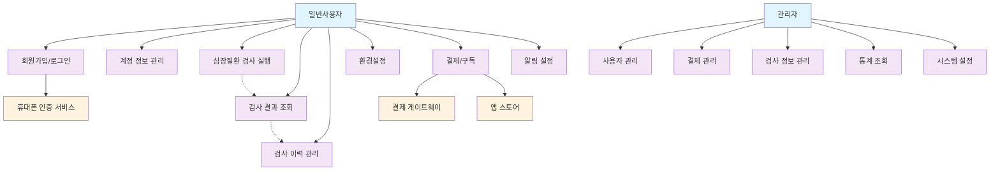

## 6. 사용사례 명세

### UC-001: 회원가입

| 항목 | 내용 |
|------|------|
| **주요 액터** | 일반사용자 |
| **전제조건** | 앱이 설치되어 있음 |
| **후조건** | 사용자 계정이 생성됨 |

#### 주 시나리오
1. 사용자가 회원가입 버튼을 클릭한다
2. 시스템이 회원가입 폼을 표시한다
3. 사용자가 계정 정보를 입력한다
4. 시스템이 휴대폰 인증을 요청한다
5. 사용자가 인증번호를 입력한다
6. 시스템이 계정을 생성하고 확인 메시지를 표시한다

#### 대안 시나리오
> **4a.** 인증번호가 틀린 경우: 재전송 또는 재입력 유도

---

### UC-002: 심장질환 검사 실행 (음성 문진)

| 항목 | 내용 |
|------|------|
| **주요 액터** | 일반사용자 |
| **전제조건** | 사용자가 로그인되어 있고 마이크 권한이 허용됨 |
| **후조건** | 문진 결과가 저장되고 분석 결과가 표시됨 |

#### 주 시나리오
1. 사용자가 '검사 시작' 버튼을 클릭한다
2. 시스템이 음성 문진 안내를 표시한다
3. 시스템이 첫 번째 문진 질문을 음성으로 재생한다
4. 사용자가 '예' 또는 '아니요' 버튼을 클릭하거나 음성으로 답변한다
5. 시스템이 답변을 기록하고 다음 질문으로 진행한다
6. 3-5단계를 총 5-6개 질문에 대해 반복한다
7. 모든 질문 완료 후 시스템이 문진 데이터를 분석한다
8. 시스템이 6가지 유형 중 하나의 결과를 표시한다
9. 시스템이 문진 결과와 분석 결과를 서버에 저장한다

#### 대안 시나리오
> **3a.** 음성 재생 실패: 텍스트로 질문 표시 및 재시도 옵션 제공
>
> **4a.** 음성 인식 실패: 버튼 터치로 답변 유도
>
> **4b.** 사용자 무응답: 30초 후 질문 반복 또는 일시정지 안내
>
> **7a.** 분석 실패: 오류 메시지 표시 및 재검사 옵션 제공

#### 문진 질문 세트
1. **심장 통증**: "최근 한 달 동안 가슴 통증을 경험하신 적이 있나요?"
2. **호흡 곤란**: "계단을 오르거나 빠르게 걸을 때 숨이 차시나요?"
3. **심계 항진**: "가슴이 두근거리거나 불규칙하게 뛰는 증상이 있나요?"
4. **어지럼증**: "어지럽거나 실신한 경험이 있나요?"
5. **가족력**: "가족 중에 심장병 병력이 있나요?"
6. **복용 약물**: "현재 복용 중인 심장 관련 약물이 있나요?"

---

### UC-003: 결제/구독

| 항목 | 내용 |
|------|------|
| **주요 액터** | 일반사용자 |
| **전제조건** | 사용자가 로그인되어 있고 결제할 요금제를 선택함 |
| **후조건** | 구독이 활성화되고 결제 내역이 저장됨 |

#### 주 시나리오
1. 사용자가 요금제를 선택한다
2. 시스템이 결제 정보 입력 화면을 표시한다
3. 사용자가 결제 정보를 입력한다
4. 시스템이 결제 게이트웨이로 결제를 처리한다
5. 결제가 승인되면 구독이 활성화된다
6. 시스템이 결제 완료 확인을 표시한다

#### 대안 시나리오
> **4a.** 결제 실패: 실패 사유 표시 및 재시도 옵션 제공

---

### UC-004: 백오피스 관리

| 항목 | 내용 |
|------|------|
| **주요 액터** | 관리자 |
| **전제조건** | 관리자가 로그인되어 있음 |
| **후조건** | 관리 데이터가 업데이트됨 |

#### 주 시나리오
1. 관리자가 백오피스에 접근한다
2. 시스템이 관리 메뉴를 표시한다
3. 관리자가 관리할 항목을 선택한다
4. 시스템이 해당 데이터를 표시한다
5. 관리자가 필요한 수정을 수행한다
6. 시스템이 변경사항을 저장한다

## 7. Class Diagram

### 핵심 엔티티 클래스

#### User (사용자)
```
class User {
    - userId: Long
    - username: String
    - password: String
    - email: String
    - phoneNumber: String
    - createdAt: Date
    --
    + register()
    + login()
    + updateProfile()
    + deleteAccount()
}
```

#### TestResult (검사 결과)
```
class TestResult {
    - resultId: Long
    - userId: Long
    - testData: String
    - resultType: Int
    - testDate: Date
    - analysisResult: JSON
    --
    + save()
    + getByUserId()
    + getHistory()
    + analyze()
}
```

#### Subscription (구독)
```
class Subscription {
    - subscriptionId: Long
    - userId: Long
    - planType: String
    - startDate: Date
    - endDate: Date
    - status: String
    --
    + activate()
    + deactivate()
    + isActive()
    + renew()
}
```

### 관계형 클래스

#### UserSettings (사용자 설정)
```
class UserSettings {
    - settingsId: Long
    - userId: Long
    - language: String
    - inputMethod: String
    - usageTime: Int
    - notifications: Boolean
    --
    + updateLanguage()
    + setInputMethod()
    + setUsageTime()
    + toggleNotification()
}
```

#### Payment (결제)
```
class Payment {
    - paymentId: Long
    - userId: Long
    - amount: BigDecimal
    - paymentDate: Date
    - paymentMethod: String
    - status: String
    --
    + processPayment()
    + refund()
    + getHistory()
    + validatePayment()
}
```

### 관리자 클래스

#### Admin (관리자)
```
class Admin {
    - adminId: Long
    - username: String
    - password: String
    - role: String
    - lastLogin: Date
    --
    + login()
    + manageUsers()
    + viewStatistics()
    + generateReports()
}
```

#### SystemConfig (시스템 설정)
```
class SystemConfig {
    - configId: Long
    - configKey: String
    - configValue: String
    - description: String
    - updatedAt: Date
    --
    + getValue()
    + setValue()
    + getAll()
    + reload()
}
```

#### NotificationJob (알림 작업)
```
class NotificationJob {
    - jobId: Long
    - userId: Long
    - scheduleTime: DateTime
    - message: String
    - status: String
    --
    + schedule()
    + send()
    + cancel()
    + getStatus()
}
```

### 클래스 관계도

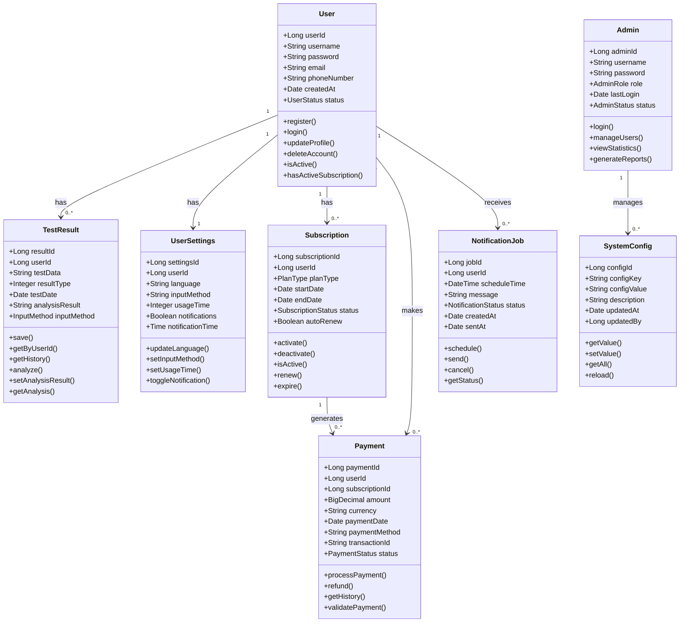

## 8. 데이터베이스 스키마 테이블 명세

> **MySQL 8.0 기반 데이터베이스 설계**

### 8.1 users 테이블
```sql
CREATE TABLE users (
    user_id BIGINT AUTO_INCREMENT PRIMARY KEY,
    username VARCHAR(50) NOT NULL UNIQUE,
    password VARCHAR(255) NOT NULL,
    email VARCHAR(100) NOT NULL UNIQUE,
    phone_number VARCHAR(20),
    created_at TIMESTAMP DEFAULT CURRENT_TIMESTAMP,
    updated_at TIMESTAMP DEFAULT CURRENT_TIMESTAMP ON UPDATE CURRENT_TIMESTAMP,
    status ENUM('ACTIVE', 'INACTIVE', 'SUSPENDED') DEFAULT 'ACTIVE',
    INDEX idx_username (username),
    INDEX idx_email (email)
);
```

### 8.2 test_results 테이블
```sql
CREATE TABLE test_results (
    result_id BIGINT AUTO_INCREMENT PRIMARY KEY,
    user_id BIGINT NOT NULL,
    test_data TEXT NOT NULL,
    result_type TINYINT NOT NULL COMMENT '1-6: 6가지 결과 유형',
    analysis_result JSON,
    test_date TIMESTAMP DEFAULT CURRENT_TIMESTAMP,
    input_method ENUM('TEXT', 'VOICE') DEFAULT 'TEXT',
    FOREIGN KEY (user_id) REFERENCES users(user_id) ON DELETE CASCADE,
    INDEX idx_user_date (user_id, test_date),
    INDEX idx_result_type (result_type)
);
```

### 8.3 subscriptions 테이블
```sql
CREATE TABLE subscriptions (
    subscription_id BIGINT AUTO_INCREMENT PRIMARY KEY,
    user_id BIGINT NOT NULL,
    plan_type ENUM('MONTHLY', 'YEARLY', 'LIFETIME') NOT NULL,
    start_date TIMESTAMP DEFAULT CURRENT_TIMESTAMP,
    end_date TIMESTAMP,
    status ENUM('ACTIVE', 'EXPIRED', 'CANCELLED') DEFAULT 'ACTIVE',
    auto_renew BOOLEAN DEFAULT TRUE,
    FOREIGN KEY (user_id) REFERENCES users(user_id) ON DELETE CASCADE,
    INDEX idx_user_status (user_id, status),
    INDEX idx_end_date (end_date)
);
```

### 8.4 payments 테이블
```sql
CREATE TABLE payments (
    payment_id BIGINT AUTO_INCREMENT PRIMARY KEY,
    user_id BIGINT NOT NULL,
    subscription_id BIGINT,
    amount DECIMAL(10,2) NOT NULL,
    currency VARCHAR(3) DEFAULT 'KRW',
    payment_date TIMESTAMP DEFAULT CURRENT_TIMESTAMP,
    payment_method ENUM('CREDIT_CARD', 'GOOGLE_PAY', 'APPLE_PAY') NOT NULL,
    transaction_id VARCHAR(100),
    status ENUM('PENDING', 'COMPLETED', 'FAILED', 'REFUNDED') DEFAULT 'PENDING',
    FOREIGN KEY (user_id) REFERENCES users(user_id) ON DELETE CASCADE,
    FOREIGN KEY (subscription_id) REFERENCES subscriptions(subscription_id),
    INDEX idx_user_date (user_id, payment_date),
    INDEX idx_transaction (transaction_id)
);
```

### 8.5 user_settings 테이블
```sql
CREATE TABLE user_settings (
    settings_id BIGINT AUTO_INCREMENT PRIMARY KEY,
    user_id BIGINT NOT NULL,
    language ENUM('KO', 'EN') DEFAULT 'KO',
    input_method ENUM('TEXT', 'VOICE', 'BOTH') DEFAULT 'TEXT',
    usage_time_per_day TINYINT DEFAULT 5,
    notification_enabled BOOLEAN DEFAULT TRUE,
    notification_time TIME DEFAULT '09:00:00',
    updated_at TIMESTAMP DEFAULT CURRENT_TIMESTAMP ON UPDATE CURRENT_TIMESTAMP,
    FOREIGN KEY (user_id) REFERENCES users(user_id) ON DELETE CASCADE,
    UNIQUE KEY unique_user (user_id)
);
```

### 8.6 admins 테이블
```sql
CREATE TABLE admins (
    admin_id BIGINT AUTO_INCREMENT PRIMARY KEY,
    username VARCHAR(50) NOT NULL UNIQUE,
    password VARCHAR(255) NOT NULL,
    role ENUM('SUPER_ADMIN', 'ADMIN', 'OPERATOR') DEFAULT 'OPERATOR',
    last_login TIMESTAMP,
    created_at TIMESTAMP DEFAULT CURRENT_TIMESTAMP,
    status ENUM('ACTIVE', 'INACTIVE') DEFAULT 'ACTIVE',
    INDEX idx_username (username)
);
```

### 8.7 system_config 테이블
```sql
CREATE TABLE system_config (
    config_id BIGINT AUTO_INCREMENT PRIMARY KEY,
    config_key VARCHAR(100) NOT NULL UNIQUE,
    config_value TEXT,
    description VARCHAR(255),
    updated_at TIMESTAMP DEFAULT CURRENT_TIMESTAMP ON UPDATE CURRENT_TIMESTAMP,
    updated_by BIGINT,
    FOREIGN KEY (updated_by) REFERENCES admins(admin_id)
);
```

### 8.8 notification_jobs 테이블
```sql
CREATE TABLE notification_jobs (
    job_id BIGINT AUTO_INCREMENT PRIMARY KEY,
    user_id BIGINT NOT NULL,
    schedule_time TIMESTAMP NOT NULL,
    message TEXT NOT NULL,
    status ENUM('SCHEDULED', 'SENT', 'FAILED', 'CANCELLED') DEFAULT 'SCHEDULED',
    created_at TIMESTAMP DEFAULT CURRENT_TIMESTAMP,
    sent_at TIMESTAMP NULL,
    FOREIGN KEY (user_id) REFERENCES users(user_id) ON DELETE CASCADE,
    INDEX idx_schedule_time (schedule_time),
    INDEX idx_user_status (user_id, status)
);
```

## 9. 클래스 명세

### 9.1 User 클래스
```java
@Entity
@Table(name = "users")
public class User {
    @Id
    @GeneratedValue(strategy = GenerationType.IDENTITY)
    private Long userId;

    @Column(unique = true, nullable = false)
    private String username;

    // 비즈니스 메서드
    public boolean isActive() {
        return status == UserStatus.ACTIVE;
    }

    public boolean hasActiveSubscription() {
        return subscriptions.stream()
            .anyMatch(sub -> sub.isActive());
    }
}
```

### 9.2 TestResult 클래스
```java
@Entity
@Table(name = "test_results")
public class TestResult {
    @Id
    @GeneratedValue(strategy = GenerationType.IDENTITY)
    private Long resultId;

    // 비즈니스 메서드
    public void setAnalysisResult(HeartDiseaseAnalysis analysis) {
        this.resultType = analysis.getResultType();
        this.analysisResult = analysis.toJson();
    }

    public HeartDiseaseAnalysis getAnalysis() {
        return HeartDiseaseAnalysis.fromJson(this.analysisResult);
    }
}
```

### 9.3 Subscription 클래스
```java
@Entity
@Table(name = "subscriptions")
public class Subscription {
    @Id
    @GeneratedValue(strategy = GenerationType.IDENTITY)
    private Long subscriptionId;

    // 비즈니스 메서드
    public boolean isActive() {
        if (status != SubscriptionStatus.ACTIVE) {
            return false;
        }

        if (planType == PlanType.LIFETIME) {
            return true;
        }

        return endDate != null && endDate.isAfter(LocalDateTime.now());
    }
}
```

## 10. 알고리즘 명세

### 10.1 심장질환 분석 알고리즘
```java
public class HeartDiseaseAnalysisAlgorithm {

    /**
     * 심장질환 분석 메인 알고리즘
     * @param inputData 사용자 입력 데이터
     * @return 분석 결과 (1-6 타입)
     */
    public HeartDiseaseAnalysis analyze(String inputData) {
        // 1단계: 데이터 전처리
        ProcessedData processedData = preprocessData(inputData);

        // 2단계: 특징 추출
        FeatureVector features = extractFeatures(processedData);

        // 3단계: ML 모델 실행
        MLModelResult modelResult = executeMLModel(features);

        // 4단계: 결과 분류 (1-6 타입)
        int resultType = classifyResult(modelResult);

        // 5단계: 결과 메시지 생성
        String message = generateResultMessage(resultType, modelResult);

        return new HeartDiseaseAnalysis(resultType, message, modelResult.getConfidence());
    }

    /**
     * 데이터 전처리
     */
    private ProcessedData preprocessData(String inputData) {
        // 의사코드: 텍스트 정규화 및 의료 용어 표준화
        // 1. 텍스트 정규화
        // 2. 불용어 제거
        // 3. 의료 용어 표준화
    }

    /**
     * 특징 추출
     */
    private FeatureVector extractFeatures(ProcessedData data) {
        // 의사코드: 증상 관련 특징 추출
        // 1. 증상 심각도 계산
        // 2. 키워드 기반 특징 추출
        // 3. 증상 빈도 분석
    }

    /**
     * 결과 분류 (1-6 타입)
     */
    private int classifyResult(MLModelResult result) {
        // 의사코드: 가장 높은 확률의 인덱스를 찾아 1-6 범위로 변환
        double[] probabilities = result.getProbabilities();
        return findMaxIndex(probabilities) + 1;
    }
}
```

### 10.2 음성-텍스트 변환 알고리즘
```typescript
class SpeechToTextProcessor {

    /**
     * 음성 데이터를 텍스트로 변환
     */
    async convertSpeechToText(audioData: Blob): Promise<string> {
        try {
            // 1단계: 오디오 전처리
            const processedAudio = await this.preprocessAudio(audioData);

            // 2단계: 플랫폼별 STT API 호출
            const platform = Platform.OS;
            let transcription: string;

            if (platform === 'ios') {
                transcription = await this.processiOSSpeech(processedAudio);
            } else {
                transcription = await this.processAndroidSpeech(processedAudio);
            }

            // 3단계: 후처리
            const cleanedText = this.postprocessText(transcription);

            return cleanedText;

        } catch (error) {
            throw new Error(`음성 변환 실패: ${error.message}`);
        }
    }

    /**
     * 오디오 전처리
     */
    private async preprocessAudio(audioData: Blob): Promise<ArrayBuffer> {
        // 의사코드: 노이즈 제거, 볼륨 정규화, 샘플링 레이트 조정
    }

    /**
     * 텍스트 후처리
     */
    private postprocessText(text: string): string {
        // 의사코드: 의료 용어 보정, 문장 부호 정리, 불필요한 공백 제거
    }
}
```

### 10.3 알림 스케줄링 알고리즘
```java
@Service
public class NotificationScheduler {

    /**
     * 사용자 알림 스케줄링
     */
    public void scheduleUserNotifications(User user, UserSettings settings) {
        // 기존 알림 취소
        cancelExistingNotifications(user.getUserId());

        // 새로운 알림 스케줄 생성
        List<LocalDateTime> scheduleTimes = calculateScheduleTimes(settings);

        for (LocalDateTime scheduleTime : scheduleTimes) {
            scheduleNotification(user, scheduleTime, settings);
        }
    }

    /**
     * 알림 시간 계산
     */
    private List<LocalDateTime> calculateScheduleTimes(UserSettings settings) {
        // 의사코드: 일주일간의 알림 시간 계산
        // 1. 기본 시간에서 간격을 두어 분산
        // 2. 하루에 설정된 횟수만큼 분산
    }

    /**
     * 알림 발송
     */
    private void sendNotification(NotificationJob job) {
        // 의사코드: FCM을 통한 푸시 알림 발송
        // 1. FCM 메시지 구성
        // 2. 알림 발송
        // 3. 발송 결과 처리
    }
}
```

## 11. 사용자 인터페이스(UI) 설계

### 11.1 앱 화면 구조도

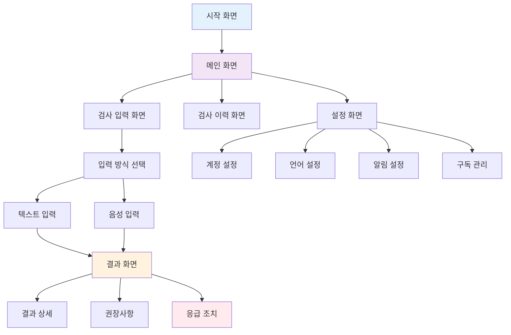

### 11.2 메인 화면 와이어프레임

```
┌─────────────────────────────────────────────────────┐
│  ≡  Heart Health Checker                     ⋮ ≡   │ <- 헤더 (파란색)
├─────────────────────────────────────────────────────┤
│                                                     │
│  ┌─────────────────────────────────────────────┐   │
│  │              검사 시작하기                     │   │ <- 메인 버튼 (빨간색)
│  │                                             │   │
│  │        지금 심장 상태를 확인해보세요            │   │
│  └─────────────────────────────────────────────┘   │
│                                                     │
│  ┌─ 최근 검사 결과 ──────────────────────────────┐   │
│  │                                             │   │
│  │  📅 2024.01.15  [✓ 정상]      신뢰도: 95%    │   │ <- 정상 (초록)
│  │  ───────────────────────────────────────    │   │
│  │  📅 2024.01.10  [⚠ 주의필요]   신뢰도: 87%    │   │ <- 주의 (주황)
│  │  ───────────────────────────────────────    │   │
│  │  📅 2024.01.05  [✓ 정상]      신뢰도: 92%    │   │ <- 정상 (초록)
│  │                                             │   │
│  └─────────────────────────────────────────────┘   │
│                                                     │
│  ┌─ 오늘의 목표 ──────────────────────────────────┐   │
│  │  검사 진행률: ████████░░  80% (4/5 완료)       │   │ <- 진행바 (파란색)
│  └─────────────────────────────────────────────┘   │
│                                                     │
│  ┌─────────────────┐  ┌─────────────────────────┐   │
│  │   📅 검사 이력    │  │      ⚙️ 설정            │   │ <- 하단 버튼들
│  │                 │  │                         │   │   (보라색)
│  │  과거 검사 결과   │  │  알림, 언어, 구독관리     │   │
│  │     확인         │  │                         │   │
│  └─────────────────┘  └─────────────────────────┘   │
│                                                     │
└─────────────────────────────────────────────────────┘
```

### 11.3 음성 문진 검사 화면 와이어프레임

```
┌─────────────────────────────────────────────────────┐
│  ←  심장질환 검사                              ⋮     │ <- 내비게이션 (파란색)
├─────────────────────────────────────────────────────┤
│                                                     │
│                 음성 문진 검사                       │
│                                                     │
│  ┌─ 💡 검사 안내 ────────────────────────────────┐   │
│  │  AI가 음성으로 질문하면 '예' 또는 '아니요'로      │   │ <- 안내 (파란색)
│  │  답변해 주세요. 총 5-6개의 질문이 있습니다.       │   │
│  └─────────────────────────────────────────────┘   │
│                                                     │
│  ┌─ 🎤 현재 질문 ───────────────────────────────┐   │
│  │                                             │   │ <- 질문 영역
│  │         🔊 질문 1/6                          │   │   (회색 배경)
│  │                                             │   │
│  │    "최근 가슴 통증을 경험하신 적이 있나요?"      │   │
│  │                                             │   │
│  │         ♪ ♪ ♪ 음성 재생 중...                │   │ <- 음성 재생 표시
│  │                                             │   │
│  └─────────────────────────────────────────────┘   │
│                                                     │
│  ┌─ 📢 응답 버튼 ───────────────────────────────┐   │
│  │                                             │   │
│  │  ┌─────────────────┐  ┌─────────────────────┐ │   │ <- 응답 버튼
│  │  │      ✅ 예       │  │     ❌ 아니요        │ │   │   (초록/빨간)
│  │  │                 │  │                     │ │   │
│  │  │   (터치 또는     │  │   (터치 또는        │ │   │
│  │  │    음성으로)     │  │    음성으로)        │ │   │
│  │  └─────────────────┘  └─────────────────────┘ │   │
│  │                                             │   │
│  └─────────────────────────────────────────────┘   │
│                                                     │
│  ┌─ 📊 진행 상황 ───────────────────────────────┐   │
│  │                                             │   │ <- 진행바
│  │  질문 진행률: ████░░  2/6 완료 (33%)           │   │   (파란색)
│  │                                             │   │
│  │  ┌─────┐ ┌─────┐ ┌─────┐ ┌─────┐ ┌─────┐   │   │
│  │  │  ✓  │ │  ✓  │ │  ?  │ │  -  │ │  -  │   │   │ <- 질문별 상태
│  │  └─────┘ └─────┘ └─────┘ └─────┘ └─────┘   │   │   (완료/현재/대기)
│  │                                             │   │
│  └─────────────────────────────────────────────┘   │
│                                                     │
│  ┌─────────────────┐  ┌─────────────────────────┐   │
│  │   🔄 질문 다시   │  │      ⏸️ 일시정지         │   │ <- 하단 버튼들
│  │      듣기       │  │                         │   │   (회색)
│  └─────────────────┘  └─────────────────────────┘   │
│                                                     │
└─────────────────────────────────────────────────────┘
```

#### 문진 질문 예시 (5-6개)

**질문 1**: "최근 한 달 동안 가슴 통증을 경험하신 적이 있나요?"
**질문 2**: "계단을 오르거나 빠르게 걸을 때 숨이 차시나요?"
**질문 3**: "가슴이 두근거리거나 불규칙하게 뛰는 증상이 있나요?"
**질문 4**: "어지럽거나 실신한 경험이 있나요?"
**질문 5**: "가족 중에 심장병 병력이 있나요?"
**질문 6**: "현재 복용 중인 심장 관련 약물이 있나요?"

### 11.4 심장질환 AI 진단 결과 화면

```
┌─────────────────────────────────────────────────────┐
│  ←  검사 결과                                 📊     │ <- 내비게이션
├─────────────────────────────────────────────────────┤
│                                                     │
│               🫀 AI 심장질환 진단 결과                │
│                                                     │
│  ┌─ 📊 예측 확률 분석 결과 ──────────────────────┐   │
│  │                                             │   │
│  │  1) 정상               ████████████ 65.2%   │   │ <- 예측 결과
│  │  2) 협심증             ████░░░░░░░░ 18.7%   │   │   (막대 그래프)
│  │  3) 심부전             ██░░░░░░░░░░  8.4%   │   │
│  │  4) 그 밖의 심장질환    █░░░░░░░░░░░  4.1%   │   │
│  │  5) 심근경색증         ░░░░░░░░░░░░  2.8%   │   │
│  │  6) 심장세동           ░░░░░░░░░░░░  0.8%   │   │
│  │                                             │   │
│  └─────────────────────────────────────────────┘   │
│                                                     │
│  ┌─ 🎯 주요 진단 결과 ──────────────────────────┐   │
│  │                                             │   │
│  │         ✅ 정상 (65.2% 확률)                 │   │ <- 최고 확률
│  │                                             │   │   결과 강조
│  │  • 현재 심장 상태가 양호합니다               │   │
│  │  • 문진 결과 특별한 이상 소견이 없습니다      │   │
│  │  • 정기적인 건강관리를 유지하시기 바랍니다    │   │
│  │                                             │   │
│  └─────────────────────────────────────────────┘   │
│                                                     │
│  ┌─ ⚠️ 주의사항 (협심증 18.7%) ─────────────────┐   │
│  │                                             │   │ <- 2위 결과
│  │  협심증 가능성이 다소 높게 나타났습니다:      │   │   주의사항
│  │                                             │   │
│  │  • 가슴 통증 증상 관찰 필요                  │   │
│  │  • 과도한 운동이나 스트레스 피하기           │   │
│  │  • 3개월 내 심장내과 정기검진 권장           │   │
│  │                                             │   │
│  └─────────────────────────────────────────────┘   │
│                                                     │
│  ┌─ 💡 AI 진단 신뢰도 ───────────────────────────┐   │
│  │                                             │   │
│  │  ████████████████████░░  87.3%              │   │ <- 신뢰도 표시
│  │                                             │   │
│  │  • 문진 답변 완성도: 100% (6/6 질문)         │   │
│  │  • 모델 학습 데이터: 50,000건 임상 사례      │   │
│  │  • 진단 정확도: 의료진 대비 91.2%           │   │
│  │                                             │   │
│  └─────────────────────────────────────────────┘   │
│                                                     │
│  ┌─────────────────┐  ┌─────────────────────────┐   │
│  │  📋 상세 보고서   │  │    🏥 병원 찾기          │   │ <- 하단 액션
│  │     다운로드     │  │                         │   │   버튼들
│  └─────────────────┘  └─────────────────────────┘   │
│                                                     │
│  ┌─────────────────┐  ┌─────────────────────────┐   │
│  │  📅 다음 검사    │  │    📞 의료진 상담        │   │
│  │     예약하기     │  │                         │   │
│  └─────────────────┘  └─────────────────────────┘   │
│                                                     │
└─────────────────────────────────────────────────────┘
```

#### 6가지 심장질환 진단 결과 유형

**1. 정상 (Normal)**
- **설명**: 문진 결과 심장 기능에 특별한 이상이 없는 상태
- **AI 코멘트**: "현재 심장 상태가 양호합니다. 정기적인 건강관리를 유지하세요."
- **권장사항**: 규칙적인 운동, 금연/금주, 연 1회 정기검진
- **조치**: 건강한 생활습관 유지

**2. 협심증 (Angina)**
- **설명**: 심장 근육으로 가는 혈류가 일시적으로 부족한 상태
- **AI 코멘트**: "협심증 가능성이 있습니다. 가슴 통증 증상을 주의 깊게 관찰하세요."
- **권장사항**: 과도한 운동 및 스트레스 피하기, 3개월 내 심장내과 검진
- **조치**: 전문의 상담 및 정밀검사 권장

**3. 심근경색증 (Myocardial Infarction)**
- **설명**: 심장 근육의 일부가 괴사되는 응급상황
- **AI 코멘트**: "심근경색 위험이 있습니다. 즉시 응급실 방문이 필요합니다."
- **권장사항**: 즉시 119 신고, 응급실 방문, 안정된 자세 유지
- **조치**: 응급 의료진 연락 및 즉시 병원 이송

**4. 심부전 (Heart Failure)**
- **설명**: 심장의 펌프 기능이 약해진 상태
- **AI 코멘트**: "심부전 증상이 의심됩니다. 호흡곤란과 부종 증상을 관찰하세요."
- **권장사항**: 염분 섭취 제한, 체중 관리, 2주 내 심장내과 방문
- **조치**: 전문의 진료 및 약물치료 상담

**5. 심장세동 (Cardiac Arrhythmia)**
- **설명**: 심장 박동이 불규칙하거나 비정상적인 상태
- **AI 코멘트**: "심장 리듬 이상이 감지되었습니다. 심계항진 증상을 모니터링하세요."
- **권장사항**: 카페인 및 알코올 제한, 1개월 내 심전도 검사
- **조치**: 부정맥 전문의 상담 권장

**6. 그 밖의 심장질환 (Other Heart Diseases)**
- **설명**: 위 5가지 외의 기타 심장 관련 질환
- **AI 코멘트**: "기타 심장질환 가능성이 있습니다. 추가 정밀검사가 필요합니다."
- **권장사항**: 종합적인 심장 정밀검사, 심장내과 전문의 상담
- **조치**: 심장 초음파, CT 등 영상의학적 검사 고려

#### AI 진단 결과 시각화 (Mermaid Chart)

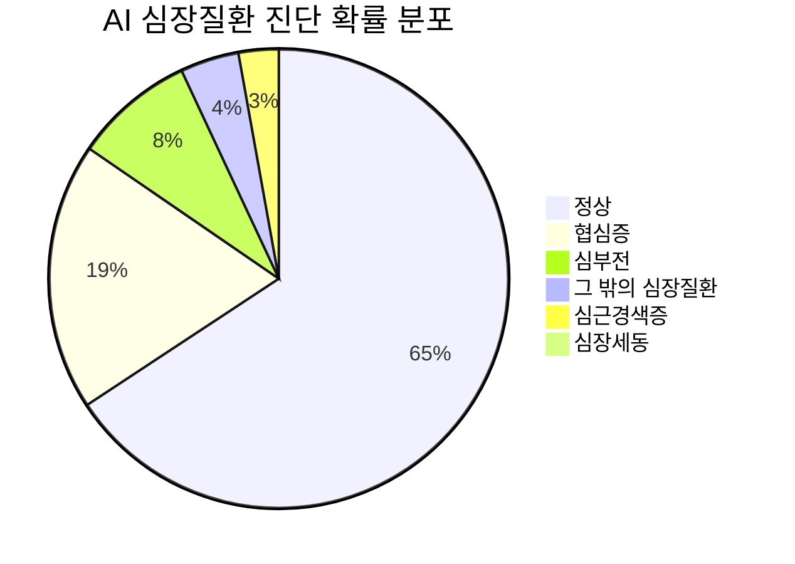

#### 진단 결과 위험도 분류

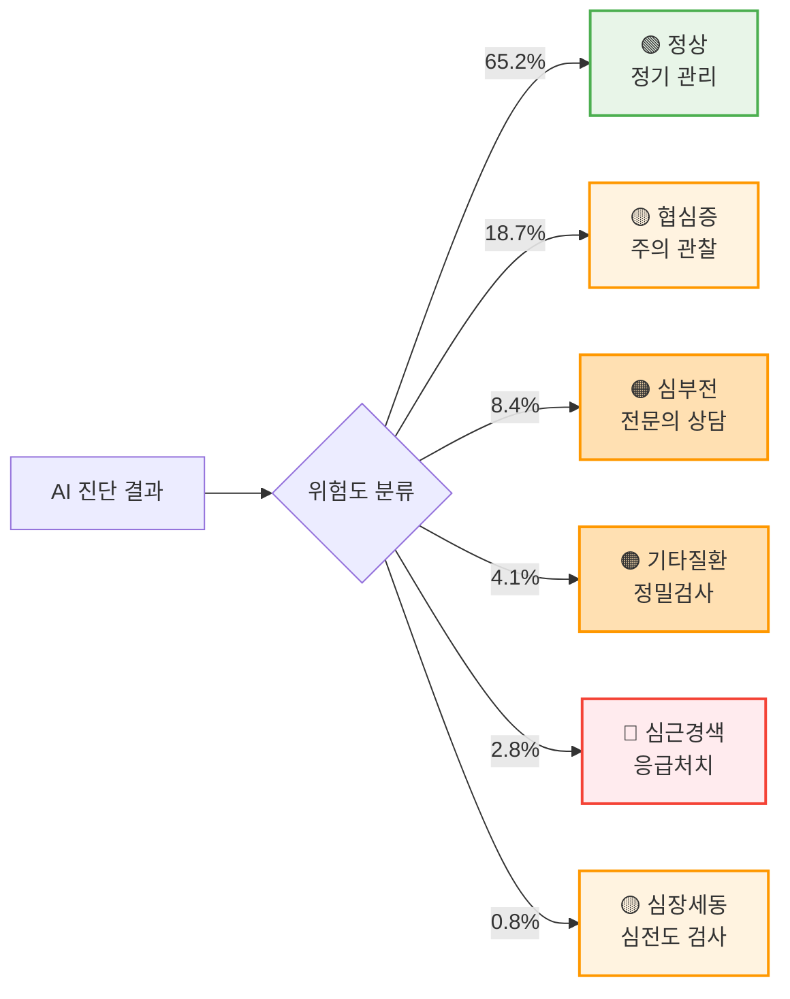

### 11.5 사용자 여정 맵

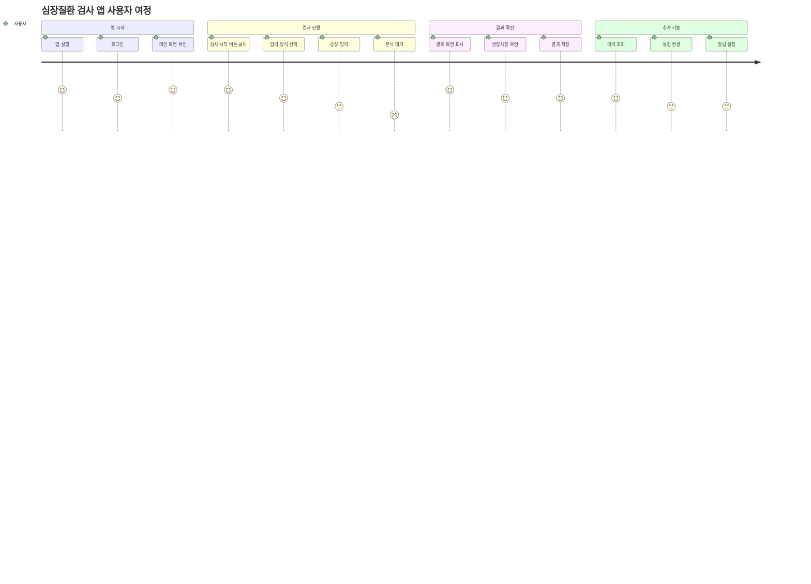

### 11.6 반응형 웹 디자인 (백오피스 대시보드)

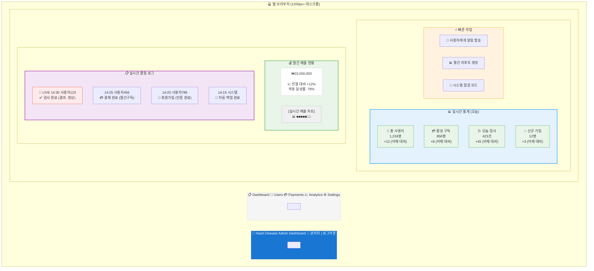

## 12. 시스템 아키텍처 설계

### 12.1 전체 시스템 아키텍처 (단순화 버전)

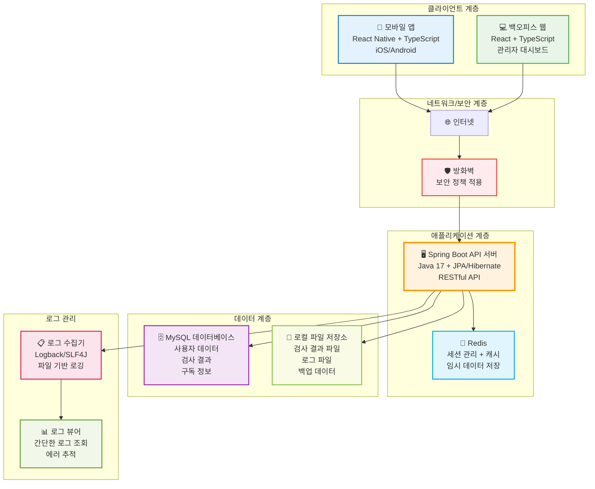

#### 아키텍처 특징

**1. 단순화된 구조**
- 로드밸런서 제거: 단일 API 서버로 직접 연결
- 단일 데이터베이스: MySQL Master-Slave 구조 제거
- 최소한의 인프라: 초기 운영에 최적화

**2. 핵심 구성 요소**
- **API 서버**: Spring Boot 기반 단일 서버
- **캐시**: Redis를 통한 세션 및 성능 최적화
- **데이터베이스**: 단일 MySQL 인스턴스
- **로그 관리**: 파일 기반 로깅 시스템

**3. 확장성 고려사항**
- 향후 트래픽 증가 시 로드밸런서 추가 가능
- 데이터베이스 복제 구조로 확장 가능
- 모니터링 시스템 추가 설치 가능

### 12.2 온프레미스 인프라 구조 (단순화 버전)

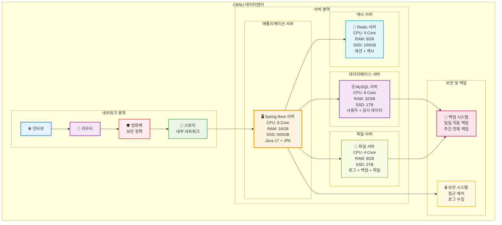

#### 인프라 특징

**1. 최소한의 서버 구성**
- **단일 애플리케이션 서버**: Spring Boot API 서버 1대
- **단일 데이터베이스**: MySQL 서버 1대
- **캐시 서버**: Redis 서버 1대
- **파일 서버**: 로그 및 백업 파일 관리

**2. 하드웨어 사양**
- **총 서버 대수**: 4대 (App + DB + Redis + File)
- **총 CPU**: 24 Core
- **총 메모리**: 64GB
- **총 저장공간**: 3.6TB

**3. 네트워크 및 보안**
- **방화벽**: 외부 접근 제어
- **백업 시스템**: 자동화된 데이터 백업
- **보안 시스템**: 접근 로그 및 모니터링

### 12.3 데이터 플로우 다이어그램

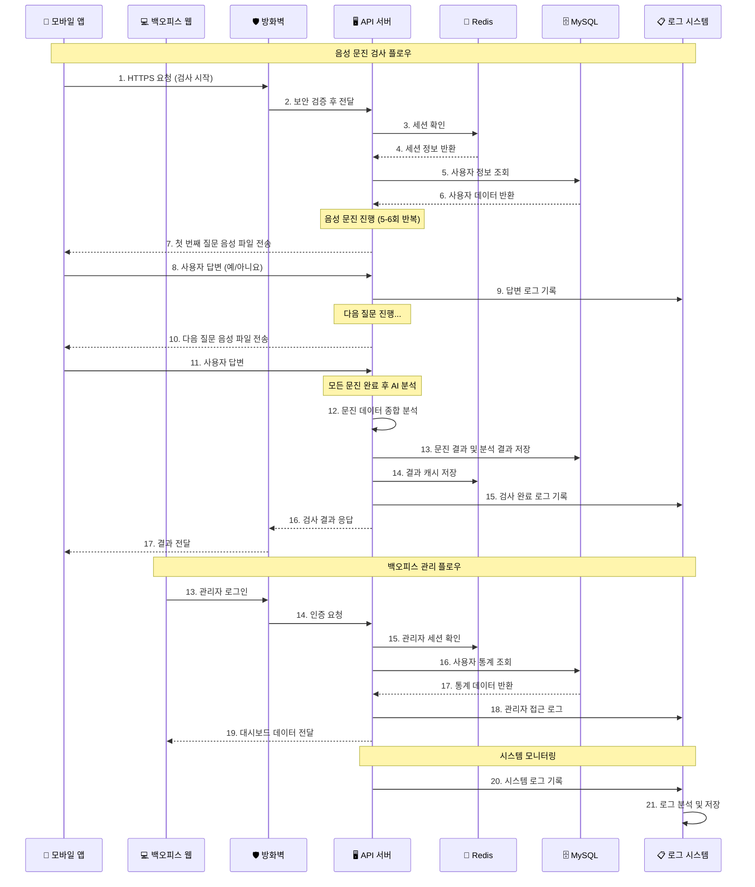

#### 주요 데이터 플로우

**1. 음성 문진 검사 처리**
- 모바일 앱 → 방화벽 → API 서버 → 음성 질문 전송
- 사용자 답변 수집 (예/아니요) → 문진 데이터 분석
- 5-6개 질문 순차 진행 후 종합 분석

**2. 세션 관리**
- Redis를 통한 세션 정보 관리
- JWT 토큰 기반 인증
- 문진 진행 상태 임시 저장

**3. 문진 데이터 저장**
- MySQL 데이터베이스에 문진 답변 및 분석 결과 영구 저장
- Redis 캐시에 문진 진행 상태 임시 저장
- 파일 시스템에 음성 질문 파일 및 로그 데이터 저장

**4. 로그 및 모니터링**
- 모든 문진 진행 과정에 대한 로그 기록
- 음성 재생 실패, 답변 지연 등 예외 상황 추적
- 문진 완료율 및 시스템 성능 메트릭 수집

### 12.4 보안 아키텍처

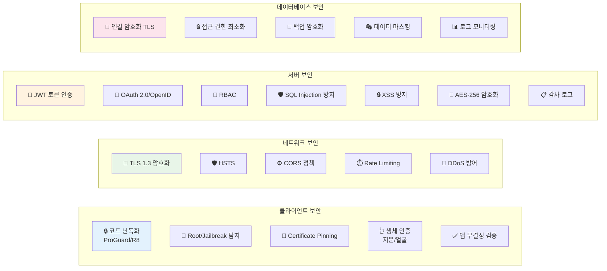

### 12.4 배포 환경 아키텍처

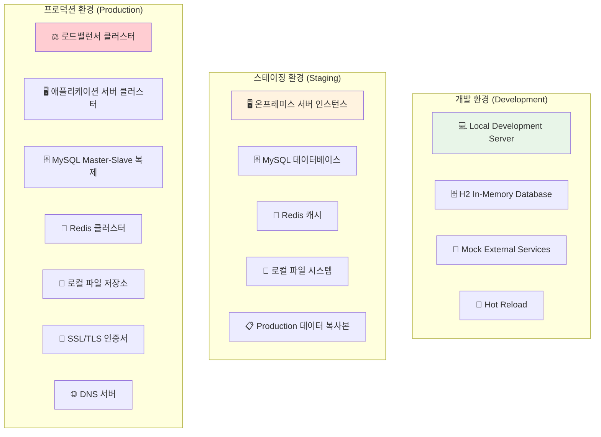

### 12.5 CI/CD 파이프라인

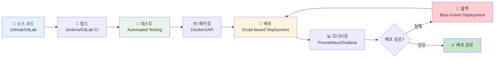

### 12.6 데이터 플로우 아키텍처

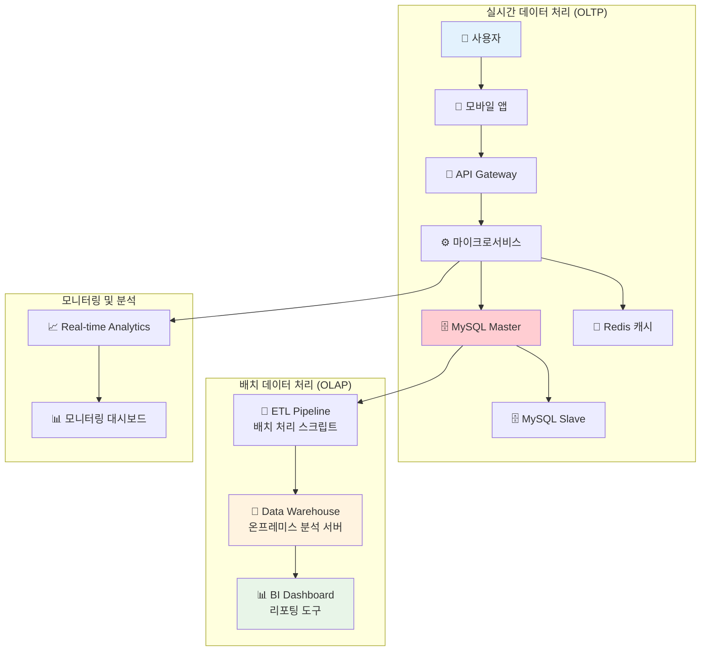

### 12.5 모니터링 및 로깅 아키텍처
```
애플리케이션 모니터링
├── Metrics: Micrometer + Prometheus
├── Health Checks: Spring Boot Actuator
├── Performance: APM (Application Performance Monitoring)
└── Error Tracking: 로그 기반 추적

인프라 모니터링
├── Server Metrics: Prometheus + Node Exporter
├── Database Metrics: MySQL Exporter
├── Network Monitoring: 네트워크 모니터링 도구
└── Security Monitoring: 보안 로그 분석

로깅 시스템
├── Application Logs: Logback + JSON Format
├── Access Logs: Nginx/HAProxy Logs
├── Audit Logs: Security Events
├── Log Aggregation: ELK Stack (Elasticsearch, Logstash, Kibana)
└── Log Retention: 법적 요구사항 준수

알림 시스템
├── Critical Alerts: 이메일/SMS
├── Performance Alerts: 대시보드 알림
├── Business Metrics: 이메일 리포트
└── Dashboard: Grafana
```

### 12.6 데이터 아키텍처
```
운영 데이터 (OLTP)
├── MySQL Master: 쓰기 전용
├── MySQL Slave: 읽기 전용 (리포팅)
├── Redis: 캐시 및 세션
└── 실시간 트랜잭션 처리

분석 데이터 (OLAP)
├── Data Warehouse: 온프레미스 분석 서버
├── ETL Pipeline: 배치 처리 스크립트
├── Business Intelligence: 리포팅 도구
└── 배치 처리 및 분석

데이터 플로우
사용자 앱 → API Gateway → 마이크로서비스 → MySQL
                     ↓
              Real-time Analytics
                     ↓
              Data Processing → Data Warehouse
                                    ↓
                              BI Dashboard
```

### 12.7 재해복구 및 백업 전략
```
백업 전략
├── MySQL: 자동 백업 (Point-in-time Recovery)
├── Redis: RDB + AOF 백업
├── 파일: 정기 백업 및 복제
├── 설정: Infrastructure as Code
└── 백업 주기: 일일 Full, 시간별 Incremental

재해복구 (DR)
├── RTO (Recovery Time Objective): 4시간
├── RPO (Recovery Point Objective): 1시간
├── 이중화 서버 구성
├── 백업 데이터 센터
├── 재해복구 사이트 (다른 물리적 위치)
└── 정기적인 DR 테스트

고가용성 (HA)
├── Load Balancer: 다중화
├── Application Server: 클러스터링
├── Database: Master-Slave + Read Replica
├── Cache: Redis Cluster
├── Monitoring: 24/7 Alert
└── 99.9% Uptime SLA
```